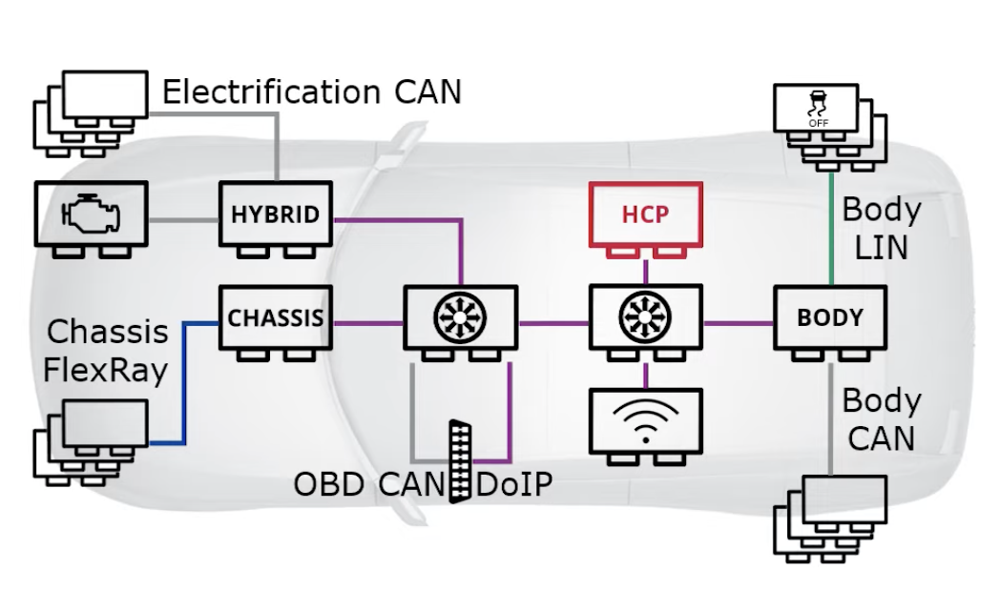
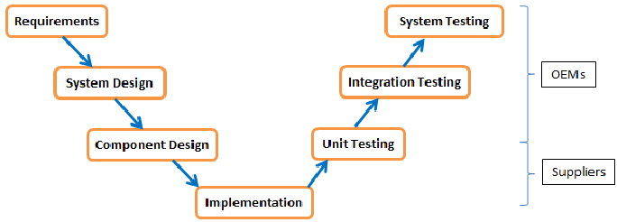

# <h1>Important Protocols</h1>

## <u> **IpSec** </u>

### **What is IpSec?**


RFC 6071(IP Security (IPsec) and Internet Key Exchange (IKE) Document Roadmap)

IPsec is a protocol that provides a secure tunnel between two computers. It is used to protect data that is transmitted over the internet. 

IPsec helps mitigation against:

- eavesdropping

- theft

- replay attacks,

- Data corruption.

Ipsec operates in 2 different modes: tunnel mode and transport mode.

In ***tunnel mode***, everything is encapsulated in IPsec datagram. when data is transmitted, the layer 3 devices only use IPsec header to route the packet.

This is used basically in the site-to-site VPN and remote access VPN.

in ***transport mode***, all of the data is protected but the original IP header is not. Payload is protected by IPsec. This is used generally in P2P applications.


### Ipsec building Blocks:

Ipsec Suite either uses **Authentication Header(AH)** or **Encapsulating Security Payload (ESP)**. One difference is that in the former, the data is encrypted.

 ESP and AH both come with options of transport and tunnel.

In the AH transport mode, the payload is encrypted and the original IP header is not protected. In the tunnel mode, the payload is encrypted and the original IP header is protected. A new IP header is appointed to the packet in tunnel mode.

ESP transport and Tunnel modes can be used as it is or with AH.

ESP enapsulates the data so we have both header and trailer in the packet in Transport mode and in Tunnel mode.

in ESP header, different than AH header, there is no next header field and payload length field.


Afther the headers, there is `Security Association (SA)`. 

Security Association in IPsec suite is a `unidirectional connection` that gives devices the capability to use AH or ESP services. for a bidirectional comms, a pair of SA is needed.

<u>In order SA to be established, the following steps are needed:</u>

- **SPI**: Security Parameter Index. It is a unique number that is used to identify the SA.

- **Security Protocol Identifier**: It is a number that identifies the protocol that is used in the SA. (50 for AH or 51 for ESP)

- **Destination IP Address**


For key management, it is either done manually or automated using IKEv1 or IKEv2.

***IKE*** (Internet Key Exchange) is a protocol that is used to establish a key management between two computers. default one is IKEv2.


Next building block is **Crypto Algorithm**. These are used for Encryption , Authentication , Integrity and Pseudorandom Number Generation.


====

for SA estabblishement, there are couple of different protocols that are used.

- <u>ISAKMP</u> (Internet Security Association Key Management Protocol) :  Used for procedures and formats to establish SA. It helps us build the SA.

- <u>OAKLEY</u> (One-Way Authentication Key Exchange Protocol) : gives key-exchange mechanissm. Used to exchange key over insecure connection using Diffie-Hellman.

- <u>SKEME</u> (Security Key Exchange Method) :gives anonimity and reputability through key-exchange techniques.

- <u>IKE</u> (Internet Key Exchange) : Uses combination of ISAKMP, OAKLEY, and SKEME


=========


### **Ipsec in Enterprise**


In enterprise level, there are 2 main uses of IPsec:

- <u>Site-to-Site VPN</u>

connect 2 or more sites together. One type of Site-to-Site VPN is `DMVPN` (Dynamic Multicast VPN).

`logically` connects sites, protects `entire` network, provides corporate resources to other sites.


- <u>Remote Access VPN</u>

`logically` connect endpoint to another network.  IPsec using the OS IP stack. protects `individual` devices.

useful in wifi hotspots.

Bu mesela bir isci evden calisirken isyerinin agina ulassin diye kullanilan vpn. ticari bireysel VPNler de bu tip, hotspotshield, NordVPN gibi.


as for IPsec implementations, there are 2 main types:


- <u>GRE over IPSec</u>

way more commen. 

encapsulates entire packet.  this is essentially DMVPN over IPSec.


- <u>IPSec over GRE  </u>

much less common. only the payload is protected via IPsec. routing information stays visible in the GRE portion of the datagram.

### <u>**IKEv2**</u>

<u>**What is IKE**?</u>

IKE is Intrnet Key Exchange that uses ISAKMP, OAKLEY, and SKEME for establishing SA for securing network traffic.

Although IKEv1 is still used, IKEv2 is the new standard and IKEv1 is obsolete.

V2 brought these:

- new authentication method EAP (Extensible Authentication Protocol) alongside PKS and PKI

- brought MOBIKE (Multicast Opportunistic Key Exchange) which allows dynamically change IP adresses without needing to re-establish the SA.

- in V1, SA lifetime was negotiated, in V2, SA lifetime is configured locally and faster negotiation.

- Flexible traffic selection per SA.


Some benefits of IKEv2 are:

- **<u>It is more reliable:</u>**

message flow system uses requests followed by responses. Initiator sends a request, and the responder sends a response. If the initiator does not receive a response, it will retry or drops the request. the reliability is on the initiator side.


- **<u>It is more Mobile:</u>**

using MOBIKE, keeps VPN conenction active when changing IP addresses. thanks to `multihoming`, when interface drops, the traffic is moved to another interface.


- **<u>it enables `High Availability`:</u>**

IKEv2 comes with `redirection` feature. if one server for VPN is taken down or went down, the users can be redirected to another server.


For authentication, IKEv2 uses` Pre-Shared Key` (PSK) and `Certificate Authentication`. Apart from that uses EAP.

***===========***============***==============***==============***==============***


## <u>**MacSec**</u>

Macsec is defined in 802.1AE as `point2point security protocol` providing `data confidentialiity, integrity, and origin authenticity` (all CIA triad.) for traffic over LAyer 1 or Layer 2 links and is part of larger security ecosystem.

Technically, on the transmit side of the link,MAcsec adds `Mac Security Tag` (SecTag, 8 to 16 bytes) and `Integrity Check Value` (ICV, 8 to 16 bytes) to the packet and can optionally encrypt the packet. on the receive side of the link the MacSec engine can identify and decrypt the packet, check integrity, provide `replay protection` and remoce SecTag and ICV. Invalid frames are discarded or monitored.


There is a need to protec data that is transmitted over the in-vehicle ethernet that is connecting `ECU`s together.

Data security protocols like MacSec are often deployed in Ethernet  Local Area Networks(LAN) that support `mission critical applications`. 

**Macsec prt the `IEEE 802.1AE` standard PREVENTS LAYER 2 SECURITY THREATS SUCH AS PASSIVE WIRETAPPING, INTRUSION, MITM, AND REPLAY ATTACKS BY OFFERING LINE-RATE ENCRYPTION AND PROTECTION OF TRAFFIC LASSING OVER LAYER 1 AND/OR LAYER 2 LINKS.**

Although it is desirable, it is **not practical to secure the entire network against physical access** by determined attackers. **Macsec allows only authorized systems that attach to and interconnect LANs in a network** to maintain confidentiality and integrity of data and take measures against data theft.


- **<u>Where does Macsec fit within OSI-layer model?</u>**


On the layer 1, there is Automotive Ethernet Physical Layer (AEPL) which is the layer that connects the physical layer of the vehicle to the network. these are like 100baseT, 1000baseT etc.

On the next layer, which is Layer 2, there is IEEE Ethernet MAc + VLAN(802.1Q) + AVB(802.1Qav) + TSN + `MacSec`. Hence, macsec is a layer 2 protocol that is sitting on top of the bare metal.

On the layer 3, there is IPv4 and IPv6 which are protected by `IpSec`. Hence IpSec is a layer 3 protocol.


- **<u>What are some common Security Threats?</u>**

These are some of the common threats against Ethernet Lan:

- - Eavesdropping (compromising routers, links, DNS, or algorithms)

- - Sending arbitrary data including IP headers.

- - Replay attacks.

- - Tampering message in transit.

- - writing malicious code and deceiving people into running it.

- - exploiting bugs in software to take over machines ans use them as base for future attacks.


While IPsec is encryption at Layer 3, MacSec is encryption at Layer 2 which is Ethernet layer.

Remember this : ==> `IEEE 802.1AE`

Compared to IPsec:

- MacSec provides STRONGER ENCRYPTION performance at HIGHER SPEEDS.

- Macsec can encrypt user data at UP TO 800Gig Ethernet Speeds without any hardware offloading.

- Very little latency.

- Application to any network that relies on Ethernet so can be used in many places => so Data Center, Corporate environment, Service Provider, etc.

- Allows to protect all protocols virtually, including layer 2 protocols like AVB TP (IEEE 1722)
- The smallest attack surface on Ethernet-based links for attacks with physical access to a medium

IPSEC and TLS are software based but MacSec is hardware(phy and switches) based. so it makes it more robust and secure!

### Packet Structure:

A captured MacSec packet has some options and payloads.

-> <u>**802.1AE Security Tag.**</u>

This Tag has some option flags like VER, ES, E.

E flag is set to 1 if the packet is `encrypted`.


-> <u>**ICV Value**</u>

ICV is a checksum that is used to verify the integrity of the packet.

-> <u>**Port Identifier.**</u>

shows on what port the packet was captured on.

-> <u>**Data**</u>

Data is the encrypted payload. looks like a random hash value.


### <u> MacSec Terminology</u>:

1. <u>**MacSec Key Agreement Protocol**</u>

Used to discover Macsec capable peers and used to negotiate encryption keys. These keys are for `data encryption` and `Security Associataion Key Encryption`(SAK)


2. <u>**Connectivity Association (CA)**</u>

Similar to `IPSec SA` but for MacSec. Defines a secure relationship between MacSec peers.


After authentication and key exchange are performed, a secure communication link,  called `Secure Channel` is established using Macsec from one node inside CA to another.  in MAcSec protected network, each node has at least one `unidirectional secure channel`. The Secure channel does not expire and lasts for the duration of  the communication between two nodes. Each secure channel is associated with an `identifier` : the `Secure Channel Identifier` SCI. 


Within each secure channel(both transmit and receive), Secure Associations are defined. each Secure association has a corresponding `Secure Association Key` (SAK) and is identified by the Association Number field of the SecTag header. Secure Associations have limited duratuion. this is called Key Rotation.


3. <u>**Connectivity Association Key(CAK) **</u>

Static or Dynamic Key exchanged by macsec speakers. This can be seen as `primary key` that is used to device all other session keys.

So CAK is used to derive SAK keys and this SAK keys are used to encrypt the user data.

So this CAK can be statically confiugred or can be distributed by the server.

4. <u>**Connectivity Association Key Name (CKN) **</u>

Any name that defines a CAK.


5. <u>**Primary and Fallback Keys **</u>

Primary key is used to negotiate an MKA if this fails, Fallback key is used.

6. <u>** Security Association Keys(SAK)**</u>

Derived from CAK used to encrypt data as mentioned earlier.

**Within each Secure Association, `replay protection` can be performetd by checking the Packet Number field of SecTAG header agaisnt the packer number locally stored since ehac macsec packet has a uniqe sequential packet and each packet number can be used only once.**


A `Key Server` generates SAK.  If you have if you have one switch connected to another switch on ethernet link and MacSec is enabled on this switch, one of these switches will be a Key Server. You can either configure one of these switches as higher priority to make it key server


if you enable MacSec on an interface, it drops all frames except MAcsec encrypted frames. But you can configure macsec profile to allow unprotected traffic in macsec negotiation fails.


Some info on Automotive MKA(MAcSec Key Agreement)

it handles key exhcnage and comparison. in automotive in comparion to regular MKA, the key exhance timeout is reduced from 8 seconds to 30 miliseconds.


***===========***============***==============***==============***==============***


### <u>**What is IEEE 802.1X**</u>


IEEE 802.1X is a network authentication protocol that opens ports for network access when a user's identity is authenticated it also authorizes them for acess to the network.

IEEE 802.1X is an Port-Based Network Access Control(PNAC) standard that provides protected authentication for secure network access.

an 802.1X network is `different from home networks in one MAJOR way`: it  has an authntication server called `RADIUS Server` which checks user's credentials to see if they are an active member of the organization and , depending on the netwrk policies, ggrants them various access rights. This helps unique credential creation for each user, eliminating the reliance on single network password that can be easily cracked or stolen.

the RADIUS server is able to do it in various ways, typically over LDAP or SAML protocol.


### <u>**What are possible MACsec use cases within Ethernet Network**</u>

If a hacker taps into the macsec disabled network, the flowing data can be obtained by hacker and can be used to perform attacks. Hacker can target switches, can tap into the network, or can monitor the device.

if macsec is enabled, tapping or eavesdropping, or replay attacks are not possible since packets are numbered, encrypted. **HOWEVER** hacker CAN disrupt the network using DOS attack if DOS prevention is disabled. in this case, neither hacker nor the vehicle can receive the packets. if DOS prevention is Enabled, the Video stream(i.e.) remains disturbed but DOS does not propogate through the Ethernet phy.


Macsec is cost-effective and could be used in combination with other technologies like IPsec, TLS, etc.


## <u>**ARP & ArpSec**</u>

ARP is unauthenticated, insecure and primarily broadcast protocol. 

this kind of broadcasts are stopped either by routers or alike Layer 3 devices on the network. 


ARP's only job is to map logical address(IP) to physical address(MAC). Just like building numbers do not help you to figure out how to go to this house, IP addresses do not help you figure out how to traverse the network to reach a destination. Hence, ARP helps this traversing.

==> ARP helps to figure out of **known** IP addresses to **unknown** physical addresses. For this end, physical address should be added into the datagram.

So once IP is resolved to MAc address, Destination MAc is added to the datagram. it is a `MUST`

First checks the memory (Arp cache) to see if the IP address is already known. if not,it dynamically resolves the mac address to the ip address.


**ARP Security **
### <u>**ARP broadcast storms*</u>

For ARP's working mentality, all the nodes in the system receive some sort of ARP messages and use them in their buffers.

Too much broadcast traffic is called `ARP broadcast storm` and can cause the network to become unstable. If storm becomes very strong, it causes Denial of Service.

This kind of problem also causes memory and processor overloads and sometimes crashing of the machines.

Why do Broadcast storms occur?

- Bad NIC or Pyhical Loop which is a hardware problem.

- `Spanning Tree Protocol`(STP) Loop or Device Misconfiguration , which is a software problem.

- Malicious Attacks.


Using HUB instead of switch is a bad idea for exampple because it is not programmable and not intelligent on protocols and it does not have flood avoidance. 

Switches can handle this problem if `Spanning Tree Protocol` is enabled and there is no miscfguration.

how to avoid this or DDOS type of problems?

- **Rate-limiting** the traffic. Depending on the vendor, you can limit broadcast,directly limit ARP, or rate the packet/second, bit/second , percent of bandwidth.

To succesfully handle this, you need to know the baseline, `normal` traffic. There are also dangers of limiting legitimate traffics.

**IDPS systems** are also good ways to avoid this. they can help baseline setting, localize the source of the problems, can potentially help isolating network issues.

### <u>**CAM Table Flood*</u>

Switches dynamically associate the MAC addresses of any attached devices with the port to which they are connected on the switch based on the source MAC addresses of the packets passing into the physical interface.
Hence, they `allocate memory and buffer locations` called **content addressable memory (CAM)**.

There is , of course a limit for this listing. 

Maximum is 4096 entries. when an attacker connects to this switch, one of the entries is written with his mac address. What happens when the list is full?

in the older switches, whether packet was multicast, unicast, or broadcast, they would flood out all active ports with the packets which turns our switch into a `hub`. this is `MAC table flood attack`.

If switch floods,it can be seen by unauthorized people or potentially can cause Dos.


To mitigate this `Port Security` should be implemented on `per-port` basis on switches. Port Security's primary function is to authenticate and validate decices to physical ports based on MAC address.
It can use whitelisting for MAC addresses(this port accepts these MAC addresses)or can check `maximum allowed list entries`. These can be persistent or non-persistent and goes away on each reboot.

Even the attacker learn the whitelisted MAC addresses and spoof it, after trying to flood the switch, Port Security can terminate the port connection and deny attacker from flooding the entire table.


### <u>**Arp Poisoning, Blackhole, Spoofing, MITM*</u>

**ARP Poisoning** is to manipulate the ARP table of the target device to change the MAC-IP binding of the target device to another desirable MAC address.

This is done by spoofing the default gateway. This is done by tricking the clients on the network that the IP address of the default gateway is at the attacker's MAC address. how? keep sending ARP messages to client with tricky message and fill their cache without giving them time to correct it.
This way attacker becomes the gateway then the attacker attacks to the real gateway to trick it by changing the clients IP bound to attacker's MAC. From that point on, whenever the real gateway distributes the packets, it is redirected to the attacker.

from this point on, all the client packets are sent to attacker. If attacker does not forward but keep collecting these data this is called `blackhole` because attacker never sends these packets to the intended destination.


Mitigation is through `Port Security`.

Another mitigation is `802.1X` which is a network authentication protocol that opens ports for network access when a user's identity is authenticated it also authorizes them for acess to the network. This is superior to port security.

Another mitigation is `Dynamic ARP Inspection` which is a feature of switches that allows the switch to dynamically inspect the ARP table and determine if the ARP table entry is valid or not.


## <u>**SSH**</u>

secure shell.

Just like HTTP and HTTPS, the protocols SSH and TELNET are also operate in the OSI model's layer 5 which is `session` layer. 

In the OSI model, `Appliacation, Presentation, Session and Transport` layers are called `Host` layers while the remaninng `Network, Data Link and Physical` layers are called `Media` layers.

<u>Network Layer</u> ==> routers, Ipv4, Ipv6, ICMP. address assingment, routing between network nodes and control of moving network traffic possible.

<u>Data Layer</u> ==> Once the network is connected in the layer 3, Data Link layer transmits the data. A data frame is a data that holds link layer header.

A data link layer frame has the following parts: Frame Header: It contains the source and the destination addresses of the frame and the control bytes. Payload field: It contains the message to be delivered. Trailer: It contains the error detection and error correction bits.

SSH works in one of 3 ways:

- RSA rhost authentication (rhost and shost, but a bit weakly secured)

- Private-key authentication ( cari olan islem bu.)

- Password authentication

# <h1>CyberSecurity Notes</h1>


NOTE: . The main function of the **gateway** is communication protocol transactions, for example, transforming FlexRay format data to CAN data, or transforming CAN data to LIN data.

## <u>**ISO/SAE 21434**</u>
 

==> Automotive Cybersecurity standarts are defined by `ISO/SAE 21434` 

Helped creating common terminology accross the industry. 

Helped creating minimum base criteria for cybersecurity in the vehicle.

Creating security assurance level.

It is a reference that regulators point to. In order to enforce a standard, now regulators have a reference point.

The scope of ISO 21424 :

- Risk Management (Assess, monitor, evaluate potential risks.)

- Product Development (security of systems, hardware&software, 

- performing TARA(Threat Analysis Risk Assessment) )


- VARA (vulnerability analysis risk assessment)

- Operation, maintenance, and processess. Starting from beginning to the end, covers all aspects.

- process overview and interdepencencies.

- An `Assurance Level` is defined with ISO 21424 which is `Cybersecurity Assurance Level` this is like common security assurance level like how secure is the system or how much trust you can put onto it.


## <u>**CanBus IDS/IPS vs Ethernet IPS/IDS**</u>

### <u>**Comparing Can and Ethernet**</u>


CanBus is a Bus topology which means when a message leaves and ECU, it is guaranteed to reach any neighbir ecu on the same bus. Meaning there is no way to stop an attack using software which reside in the gateway since it is just listening to the traffic. Gateway can only stop propogation of the message from one bus to another but not on the same bus.

On the other hand, the ethernet is a star topology meaning on each port there is exactly one device is connected any device that is sent by the device can be inspected by the gateway.


Since ethernet is MUCH more speedy comparing to the Can, any IDS or IPS system needs lots of horsepower to be able to undertake full or partial analysis.

Message length in Can bus is only 8 bytes (60 for Can FD) compared to Ethernet which is 1500 bytes.


In terms of `source identification`, there is no source ID in can bus there is only Message ID. So you cannot tell who sent the message. This can be done using encapsulated protocols like `j1939` but standard does not have message origin identification. Can bus does not have any specific `message destionation` as well, it only has `message id` which is a `multicast` address that anyone can listen to it.

In ethernet, on the other hand, there is `distinct unicast` that means it has source and destination mac addresses, all clear. and etherenet support both unicast and multicast hence, with ethernet it is much easier to detect the source of a message.


Beware that `automotive ethernet` is not necessarily about ethernet, it is about  all the networking. For example, on top of ethernet sits MAC, and then on top of that sits IP, on top of that sits TCP/IP or UDP/IP. To the application level, there is DoIP.

### <u>**Can and Autmotive Ethernet IDS/IPS work process**</u>

IDS/IPS is designed to counter an attacker manipulating network traffic via a malicious application, hacked ECU or other controller.

It has 3 steps:

- It `learns` the normal.

- it `monitors` the network traffic and the `Routing` function of gateway rules

- it `Detects` anomalies based on deviation from `normal`. Prevents by discarding frames when possible.


<u>**Comparing CAn and Ethernet Rules Generation**</u>

- both of the them require recordings to generate rules out of it.


- Both of them use `files` where CAN uses DBC extension, ethernet uses XML.


- Both of them allow user to edit rules manually.

- Rule generation is simple in CAn Bus(but can get complicated if j1939 is used because dynamic adressing comes into play) and is complex in ethernet due to network nature (Mac adresses, DHCP, DoIO etc protocols)

- CAN is static, predictive and deterministic and uses whitelisting. But ethernet is more volatile, it uses both black and white lists simultaneously, also `signature based` detection. Signature based detection is not implemented in Can Bus.


<u>**CAN and Ethernet IDS/IPS Architecture**</u>

IDS systems are essentially sdk integrated into ecu. This ECU can be an existing ECU like gateway or a dedicated ECU attached to CAN bus.

Incoming message/frame is `routed` to IDS/IPS to be processed.

the IDS/IPS inspects the message/frame and returns its findings with the associated information.

In case of anomaly, an event is reported.

when configured as IPS, when possible, the anomalous packet is discarded.

Can message is determined to be passing or not based on message ID, if valid, it is passed else, it is discarded. There is a possibility that a compromised ECU can send a message with a valid ID and if it is not a periodic message, it is not possible to determine it was an attack.

Ethernet Packet is filtered based on filtering rules initially. if it is not in white and blacklist, the default rule applies.


**Canbus:**

In Canbus, these IDPS will most likely be integrated into gateway, in other cases, it can be connected directly into ecus.

If we use IDS not IPS, it just taps into network so there is no need for changes in the vehicle.

**Ethernet:**

it `definitely` goes into gateway. it serves as automotive backbone. 

<u>**Message Formality**</u>

**Canbus:**

Relatively easy to validate the format since the message is very short. only exception is CanBus TP(transport protocol) and SAE j1939 TP is used which adds more complexity.

**Ethernet:**

Etherned side of the message is much harded, needs 7 layer `Deep Packet Inspection(DPI)` to determine individual message format validity. For example:

- Ethernet frame

- IP header

- UDP header

- DoIP PDU header

- UDS PDU header


<u>**Protocol Message Flow**</u>

**Canbus:**

Relatively easy to validate flow, with requests and responses, and order of messages.

Impossible to determine ECU origin. Need to add digital signature using 3rd party compression softwares or SecOC.

**Ethernet:**

To capture a packet flow, you need to follow full OSI 7 layers individually and another problem is many fields are dynamically assigned per instance.


<u>**Diagnostics**</u>


**Canbus:**

- Using UDS protocol,

- Many attack options like hacker engaging diagnostics while normal driving.

- Detection and some prevention is possible but somewhat complex since it must be based on a combination of considerations such as vehicle context and usage of transport protocols.


**Ethernet:**

- based on DoIP and layered UDS protocol.

- Complex mechanism with multiple architectures and implementatitions(like DHCP)

- Many attack options like hacker engaging diagnostics while normal driving.

- sometimes detection is complex, especially if attacker is launched from compromised ECU from within the vehicle.

When running diagnostics in the test workshop using multiple vehicles connected to each other and the test machine, in order to prevent vehicle attacking to another vehicle, the configuration should be set to `multiplexler` not `full-mesh` so central gateway can talk to each vehicle but vehicles can talk to each other.

On media diagnosticsin CAN, the MOST system will not be incpected due to it is `airgapped`and low cyber risk. Also Automotive-Ethernet AVTP(Audio-Video Transfer Protocol) , which is not airgapped and very intense in traffic, will probably not be inspected but can be tested by partial sampling for protocol integrity.


<u>**Reporting**</u>


**Canbus:**

CanBus telematics messages. CAN id will send messages to be conveyed to SOC and analyzed there

Other options are possible such as independent SMS over cellular.

**Ethernet:**

a) **`SOME/IP `messages to telematics, API sending messages to microcontroller.**


it is a Control-communication protocol.

***What is SOME/IP?***

SOME/IP is a **middleware** where SOME stands for `Scalable service oriented middleware` which creates absraction in automotive and used for standardization of: 


middleware used in data exchange that often passes through a network and it is the task of the middleware to ensure that the network itself is transparent to the software components exchanging the data.


it is a Control-communication protocol.

- header format,
- payload serialization rules
- service discovery mechanism
- remote procedure call mechanism(RPC)
- service-based communication
- small footprint
- Scalable,flexible, compatible.

data needs to be serialized. the faster the communication, the more resouce hungry the serialization. so there needs to be a fast and efficient middleware to serialize data. Due to string operations, text-based serialization and deserialization(JSON, XML these are self descriptive(structured) and text based) are very slow so a binay operation neededd. SOME/IP allows you to build the most efficient hi-speed performance system,formatting is optimized for low resources and high speed directly works on binary data.
SOME/IP is like XML and JSOn, which are very slow. SOME/IP works on binary data and non-descriptive. it is fastest due to `zero-copy` and nearly as fast as Raw struct which is not serialization.


Advantages of SOME/IP Protocol
SOME/IP protocol has many advantages compared to traditional automotive protocols like CAN, LIN, and MOST. Some of the worth-noting advantages of SOME/IP are the following:

1. Some/IP is license Free.

2. SOME/IP designed automotive use cases in mind, scales very well.

3. SOME/IP provides large bandwidth for data communication in the range of 100Mbps and takes care of not wasting the bandwidth at all by providing all data communications in a client-server configuration.

4. SOME/IP is supported by `AUTOSAR`, very fast in serialization, has `built in service discovery`

5. The data from the server ECU can be communicated to client ECU via unicast, multicast, and broadcast.

6. Being a middleware, it is suitable even for CPU-intensive applications, and OS-agnostic.


The size of the SOME/IP payload field depends on the transport protocol used. For UDP, the SOME/IP payload can contain 0–1400 bytes. The decision to limit the payload length to 1400 bytes was taken in order to allow for future changes to the protocol stack, such as using IPv6 or adding security protocols.
Since TCP supports the segmentation of payloads, larger payload sizes are automatically supported.


b) **Syslog format for direct interface to SIEM at the SOC.**

c) **other proprietary formats over IP are possible.**


<u>**Some TakeAways**</u>

- threats and risks are much more severe in automotive ethernet than in CAN bus.

- several areas are similar so some R&D effort on CAN can be used for ethernet.

- IDPS for ethernet is much more complex than for CAN.

- designing IDPS for autmotife ethernet requires expertise both in automoive field and in IT networking.

- For network security, SSL/TLS, VPN, IPSec protocols are for backend connectivity, MacSEc can protect all multicast, unicast, broadcast messages at line-speed. SecOC allows application layer protection for selected use cases.

- for access control, Ethernet access Control and SOME/IP is used

## <u>**SecOC**</u>

SecOC = Secure OnBoard Communication.

SecOC protects CAN, ethernet, Flexray etc. communications. Adds security to the onboard communication.

normally Can bus , when reached, can be tapped into and tampered or even through `SOTA`(Software Over The Air) can be used to change the firmware.

This adds integrity and authenticity to the communication by being attached to the outgoing message.

in-vehicular communication vulnerabilities can be prevented by using SecOC in the comunication networdk. SecOC adds security to the `outgoing` message to achieve `integrity and authenticity` ofthe message.

It is specified to check the authenticity of a single transmitted PDU (Protocol Data Unit) in order to detect attacks such as replay attacks, message tampering, and denial of service attacks.

With SecOC implementation, **the attacker HAS TO know the sender's secret key in order to spoof a message.**

on the **sender ECU**, the SecOC module is sitting between PDURouter, CryptoService Manager and the counter.

1- PDU Router receives a PDU from an upper layer.

2- passes message to SecOC module to add authentication.

3- SecOC obtains `Freshness Value` from the counter.

4- SECOC then generates `authenticator` using  services from CryptoService Manager.

This authenticator is `freshness value + secret key` using secret key

5- SecOC then attaches the freshness value and authenticator to the `PDU Frame` and returns it to the PDU router.

6- PDU router then passes it to the destination interface. 


CSM module provides cryptographic services for SecOC.!

authenticator is also known as` MAC, Message Authentication Code` if keys are symmetrical, if asymmetric, then it is called as `signature`.


on the **receiver ECU**,


1- PDU router receives a secured PDU with authentication added from network interface.

2- this frame is sent to SecOC module for authentication

3- SecOC module strips authenticator and freshness value from the secure frame and freshness value is compared with the current counter value in the counter module.

4- if the received frame is not a fresh one then it is considered a `replay attack` and discarded.

5- through CSM,new authenticator is generated using the secret key and freshness value for comparison with the received authenticator value.

since the frehness value and secret key are the same, the keys are expected to be the same.

6- if auth is successful, then PDU is sent back to PDUR for further processing.


==

CAN bus has the limitation. Classical CAN frames provide a payloadsize of only 8 bytes. the PDU along with freshness value and authenticator cannt be supported in one frame. This leaves 2 options:

1) Truncate these fields to shorten the lenghts.

2) Send authenticator in another frame.(available in Autosar)


Between two, the tradeoff are the `security level` and `impact on busload`.


Networks like CAN FD, Flexray and Ethernet do not have payload limits.

================================================

## <u>**Vehicle Key Management Systems**</u>


<u>Automotive CyberSecurity Threat Scenarios</u>

- Do not forget that we have remote access to the vehicles.

- Also you have customer data collected and maybe stored.

- Now we have internal networks which means easy internal attack traversal (lateral movement.)

- Access to ECU-application meanis theft of intellectual properties.

- We have more software, meaning better attack surface.


<u>Some Ways to Mitigate these.</u>

- **Debug Access Protection**. This may help to prevent gain access to car network. (especially JTAG and UART)

- **Reverse Engineering Protection**. (through encryption and/or obfuscation of Data-at-rest)

- Add **Secure Boot** for preventing malicious software from being flashed over ethernet. (checking signatures)

- use **SecOC**.

- Common approach should be **Distributed Trust**. 

- **Code Signing**


Root of Trusts are : Symmetrical Keys, Asymmetrical Keys, Password Protection, certification.


Distributed trust boils down to Vehicle Key Management Systems. This means secure generation, storage, distribution and destruction of keys.

<u>***The **Goals** of Vehicle Key Management Systems are:***</u>

- ***Create*** cryptographic material:
- - which can be symmetric, asymmetric, password protected, or certificate protected.

- - Cyryptographic material can be platform, product, or even ECU specific(most complex but most secure).

- - *Good Enough* Randomness is hard to achieve. (random bit generation)


- ***Distribute*** cryptographic material:

- - these keys should be accessible to control units.

- - Keys must be stored in the control units in manifacturing.

- - ECUs are mostly manufactured on-premies at the supplier-sites but they belong to OEMs so secure onboard comms is something OEM has to make sure it works.

- - in the final assembly of the card, all keys distributed MUST fit together.


- ***Store*** cryptographic material:

- - access to locked control units must be possible after shipping the car.

- - cryptographic material must be stored **securely** **on-chip**

- - Software supported hardware security.


- ***Additional Requirements***:

- - **Security**: the material must be protected.

- - **Availability**: Manufacturer must continue development and support 24/7.

- - **Scalability**: huge amount of keys/passwords/certs must be managed.


================================================


<u>***Architecture is divided into 3 layers***:</u>

1) **Backend + Middleware**:

main component is the database which is used for <u>creating</u> and <u>storing</u> the cryptographic material.

It is usually set for `High Availability` in mind. Also, for the better security, **Hardware Security Modules** (HSM) are used alongside database.

Database are used because HSM are small in memory to keep all these data.

HSM is in charge of data-at-rest encryption and randomness generation.

Key <u>Disstribution</u> and <u>Management</u> is taken care by attached services/applications.

different interfaces are used like REST API, KMS-interfaces, OPENPGP for eMAil, proprietary interfaces etc.

interfaces may implement server-side services like encryption and signing.

2) **FrontEnd**:

frontend directly talks to the backend to undertake tasks like:

- - getting keys and flash them to ECUs in manufacturing.

- - Caching OEM-keys for asynchronous supplier-side manufacturing.

- - retrieve unit-specific passwords for root-cause analysis.

you want to store them in the backend but use it on the frontend for the key security.

depending on the use case, the frontend side application can be manual GUI, another machine ,or some library which is used by another software.

Sometimes even offline use-cases have to be supported by the VKMS like in-line flashing verification checks.


3) **In-Vehicle(network and on-chip)**


Processor/CPU + Rom/Flash + HSM.

- - Every crypto material managed by the VKMS will eventually be distributed into an ECU for in-vehicle purposes like SecOC, SecureBoot, IP-Protection.

- - Certain modules will always be present on chip for security and practicality reasons. these are Secure way of storing (Secure Hardware Extension(SHE), Software based HSM), A library/stack of hardware providing cryptographic services.(AUTOSAR Crypto Stack, Cryptoprocessor).

HSM on the chip is required for the protection of the keys stored on the chip so they are not extracted or extracted easily. SHE is specifically designed for this purpose.

Like if not stored on chip, how will it execute secure boot check, or signature checks.

- - Depending on the VKMS implementation, on-chip software might be in or out of scope.

but in any case you need to address as holistic problem.


===


## <u>**Exceprts from YouTube Videos**</u>

1)
End to End (E2E) does not mean `Application to Application` only. They all sit on a system. Thinking of the security measurements, many of them go below the application layer which are `Stack` layer and `Hardware` layer. Of these, there are MacSEc, IPSec,SecOC none of them are Application to Application.

Although TLS is an Application layer security, in AUTOSAR implementation, it is a `stack layer` security. Although in Linux, TLS can be linked to Application, when acceleration is needed for cryptography, which you need in Automotive industry, TLS is a shared resource between the application and OS levels.

2)

In automotive security, unlike IT , IP spoofing, port Spoofing etc can be prevented if the network security design works. Like hop-by-hop MACsec combined with strong filtering on Ethernet Switches causes enforcing VLANS and IPS, allows effective firewall on hosts and in the network and this allows implementing strong Access Control at many places because all these information are now trusted.

3)

Do every protocol need security build in?

for example DoIP(lives in OSI 5-7) reaches out of the vehicle so it makes sense to secure it. You can enforce security within or support it with TLS below it, or the combination of both.

But say, do we need to secure UDP Network Management(UDPnm) for network management by building security into the protocol? Technica does not think so. :D

Main idea is, if two sides of the bridge are secure, you dont need a security for the bridge. Because if you implement MacSec, which protects everything sitting on top of it, an external attacker cannot modify antyhing.

for internal attacker, who is controlling a compromised ECU, say Head Unit, you can use ACL, or sort of firewalls. But you dont put them on TCP layer, but below it to protect it. So , you DONT need built in secuirty for everyhing as long as you think secuirty first and design things accordingly.**Make sure you have access control and filtering.**

4)

Are IDPS the most important security mechanism?

There is a hype in IDS and IPS systems. but instead of going through IDS, you can stgart with createing the parth to transport `events` from vehicles to your backend and then incrementally add `events` and look at your data.

IPS on the other hand , has **actively** intervening mechanisms which can cause vehicle(especially autonomus cars) to go out of control, not-desirable.

IDS is JUST a tool in your secuirty toolbox, and you need to craete a strategy for it.


5)

Security does not allow testing.

This myth comes from the encryption of the data. However that is not correct. Think of this way:

- SecOC is authentication only and there is no encryption.

- IPSec, TLS and MACsec support authentication only modes.

How to handle `auth` does not let me change anything problem?

- add secure process to turn secuity on ECU on and off.

- add a secure process to share keys between test system and ECU.

As long as you know your tool chains and you design your process, testing is possible.

==============***=============

Standard ethernet cannot be used in cars , the EMC emission is not automotive compliant. automotive ethernet(100 and 1000 BASE T1) made some changes on phy layer to meet the requirements:

- full duplex comms
- avaliability and low cost
- reliable and fast link establishment (100 miliseconds is the upper bound)
- very low bit-rate error
- appropriate EMI and EMC missions.


Testing Considerations:

1- Define test levels according to the **V-Model**.

V stands for verification and validation


On the left side of the V-Model there is system model from more abstract to more concrete.

On the right side of the V-Model there is the integration and test levels.


- User Requirements --> Vehicle Test

entire product test, on test/prototype vehicles.focus is bring car into prod maturity.

- System Requirements --> System Test

testing behavior of `whole system` black box, HIL and SIL (software in the loop)

- System Architectural Design --> System Integration Test

test on target, performed onDUT/HIL, mainly black box testing. focus is integration and stability.

- Software REquirements --> Component TEst

Component test which is Grey Box, functionalk requirements testing

- SoftwareDesign + Software integration  

CI. automated tests, high-frequency commits and PRs


2) Design approprioate Test concept and specifications.


3) Implementation Levels: Component,EoL,Partial Network,Full Network and vehicle test solutions.

You need to consider the multitude of protocols. Physical and layer testing. individual components test(HIL). ethernet test suite, ethernet network integration test.


4) Ensure reproducibility of test results.


====================


## <u>**Verification and Validation**</u>

ISO 26262-6 is the main functional safety standard with respect to software development for high-integrity in-vehicle applications. It defines requirements and constraints for software development, verification and validation processes.


ISO 26262  guide automotive engineers to identify hazards, risks, and resulting safety goals. The check on how well the design meets those goals comes through verification and validation.

In **verification**, systems and supporting software undergo quality audits, testing, and expert reviews to confirm that all are designed to specification. During **validation**, product tests – including full operation of systems and components – ensure the end product will function as intended and confirm the adequacy of the safety goals.

ISO 26262 (―Road Vehicles - Functional Safety‖) is a standard for the design and verification of automotive systems and a buzzword!


Verification process includes checking of documents, design, code and program whereas Validation process includes testing and validation of the actual product.

Verification does not involve code execution while Validation involves code execution.

Verification uses methods like reviews, walkthroughs, inspections and desk-checking whereas Validation uses methods like black box testing, white box testing and non-functional testing.

Verification checks whether the software confirms a specification whereas Validation checks whether the software meets the requirements and expectations.

Verification finds the bugs early in the development cycle whereas Validation finds the bugs that verification can not catch.

Comparing validation and verification in software testing, Verification process targets on software architecture, design, database, etc. while Validation process targets the actual software product.

Verification is done by the QA team while Validation is done by the involvement of testing team with QA team.

Comparing Verification vs Validation testing, Verification process comes before validation whereas Validation process comes after verification.


## <u>**General E/E Knowledge**</u>


DONT FORGET THAT CAN/FLEXRAY/LIN/ETHERNET ETC ARE NOT ECU! THEY CONNECT TO ECU and ECU were BEFORE these network systems!!!! 

ONCE ECU vardi (ABS, fuel-injection gibi) sonra CAN etc geldi.


E/E stands for **'Electrical/Electronic'**

There were no electrrical/electronic parts in the vehicles in the 70s, maybe some small parts to toggle the lights.

Then came remote door unlock. and gradually put on.

These small electrical systems made use of `Electronic Control Units` (ECU) to apply rules or perform calculations which were wired to sensors, motors, actuators etc.

each of these components means more **cost** and **weight** to the vehicle.


what if we wire ECUs to each other? that reduces the wire and costs.

This means, creation of `network` in the vehicle so ECU can send / receive data.!

also, per regulations, ECUs are asked to undertake `Diagnostics` , aka OBD.

OEMs wanted to reduce the cost by finding ways to use single ECU in different (but similar) vehicles. This led them developing ECUs than can be tuned (calibrated) to match the vehicles.

With the advent of technology, we increased the thinking power of ECUS from single core 8 bit to multi core 32 bit, even adding AI.

With being connected to GPS or Web servers, the vehicles became a part of greater network. This also helped offboard calculations to be made instead of putting heavy loads on the ECU. (yani disardan aliyor veriyi mesela bazen, kendi hesaplamiyor.)


A new generation of ECU, called HCP (High-Performance Computing Platform) is coming up. Embedded systems perform single,specific job and have specialized Embedded Software.

In vehicles, these embedded systems are ECU. These provide the control functions.(logic functions, if this happens, do this.) also they provide diagnostics, calibration etc.

Unlinke microprocessors, these  microcontrollers that ECUs use come with a dedicated ram and storage.

Networks allow ECUs to share information with a reduced risk of undetected errors.

the networks used between ECU's within vehicle E/E system is called `serial communications` where serial means single stream of communication.

Sequence of voltages are applied to the network, that often directly represent binary digits (bits.)

So each bit correspods to a voltage.


Video and other `heavy` data also used in `Advanced Driver Assistance Systems` (ADAS)

Can , Lin, Flexray are `Signal oriented architectures` whereas Ethernet also allows vehicle E/E systems to use `Service-Orientated architecture` (SOA).

In some defect situations, ECU can accept diagnostic requests and send diagnostic responses. On borad Diagnostics(OBD) standardises requests, responses related to emissions control systems, their structures and contents.

 If there is  a problem in the ECU, like fault memory, this is logged and also sent in form of DTC for diagnosis.


Main ECU software are :

```
BSW (Basic Software)

RTE (Runtime Environment)

Application Software

Flash Bootloader
```


Everytime a ECU boots, flash bootloader runs and checks the main ECU software is valid or not.

it is also used when software update is in progress. the ECU software is stored in `non-volatile memory` (NVM) meaning on reboot, memory is not erased.

the FBL provides diagnostic services that allow the whole NVM to be erased and re-flashed by a network connection. also can verify the data.


what about **HCP**?

as stated above, HCP is a new generation of ECU . High-Performance Computing Platform.


nowadays, vehicles use Ethernet networks to move high volume data and they evaulate this data to build a picture of their environment to make predictions as to what happens next and how to behave or how to determine them precisely.

this requires more horse-power than ECU can provide. HCPs are primarily used for `Data-centric processing` (DCP)


What is `Data-centric processing`?

some common vehicle environments require very fast data processing mesela otonom suruculu araclari dusun, yerleri surekli degisen objeleri takip edip ona gore haber vermesi lazim.

for this end, we need `high-bandwith` network and large amount of memory. also we need `GPU` for processing the data because they split tasks into thousands of small pieces and execute them in parallel thanks to their hundreds of cores.

while ECUS use single stream of signal data, HCP needs dynamic, `service oriented` communication because single stream is not enough.

to meet the modern needs (like HCP), AUTOSAR developed a new set of specifications for the `Autosar Adaptive Platform` that runs on a POSIX operating system. (like linux.)


modern vehicles need both hardware-centric (ECU) platforms and software-centric (HCP) platforms together.


**What do future vehicles need alongside `predictability`?**


Autosar adaptive platform (for HCP) provides access to the computing power needed by future vehicles which are ACES functions.

ACES (Advanced Driver Assistance System) is a new generation of `Autosar Adaptive Platform` (ADAP) that is designed to meet the needs of future vehicles.

A ==> Automation

C ==> Connectivity

E ==> Electrification (less carbon emission)

S ==> Sharing.

HCP can provide all these ACES functions!


While ECU programs depend on signals, they cannot perceive Objects so languages like C are used. But HCP can and has to rely on objects so OOP is used, like C++.


While ECUs rely on `hard real-time` behaviors (ince ayarlanmis deadlines), HCP rely on POSIX operating systems and ACES functions.


with the 2000's there has been an ECU explosion. there were lots of ECUS in the vehicles but this had some bottleneck. because there is a limit for how many ECUs can be used in a CAN Bus.

to overcome this, **`GATEWAYS`** were introduced. Gateway is a `router`,central hub in the vehicle that securely interconnects and processes data across heterogeneous vehicle networks to and from functional domains such as powertrain, chassis and safety, body control, infotainment, telematics and advanced driving assistance systems.


later on, with the advent of Automotive Ethernet, `Functional Domain Controller` (FD-C) was introduced. they were connected via AE to ethernet SWITCHES and aggreate functions that were originally hosted by ECUs.

HCP runs Infotainments, and can also run `Predictive Traction Control`.

</br>




</br>

to problem was, there is lots lots of cabling and wiring. to adress this, we can divide a vehicle into topological zones, each with a `Zone Domain Controller` (ZDC) with busses to `IO Nodes`. that gather inputs and provide outputs relying on little amount of ECUS. still ethernet and switches are used here in interconnectedness.

this HCP, ZDC, and IO nodes enable `Software-defined vehicles`. 


So what is **AUTOSAR**?

for ECU ==> AUTOSAR Classic Platform

for HCP ==> AUTOSAR Adaptive Platform

in classical times, there were little or no ECU specification standardisation, so vehicle manufacturers had to specify everything else themselves while the suppliers had to cope with many similar but different specifications.

Because of lack of standardisation, there was no eaasy way to add new features to ECUS or move functions. This caused adding more and more ECUS for even small stuff to be handled.

Hence both manufacturers and suppliers agreed on the necessity of a standardisation. The result was 

*Automotive Open System Architecture (AUTOSAR)* which standardized bthe specifications for  ECU  software y dividing the architecture into the stacks and modules with well-defined responsiblities.

it not only standarddized but also set `methodology`  and `file formats`(Autosar XML) to be used by software tools.


AUTOSAR `foundation` specification helps Autosar classic and adaptive platforms to be used together.


at the heart of AUTOSAR architecture is the `Run-Time Environment` (RTE) which is a software stack that provides the basic services for the ECU.

AUTOSAR RTE is the Run-Time Environment (RTE) that is the heart of the AUTOSAR ECU architecture. It provides the infrastructure services that enable communication between AUTOSAR software components. It is acting as the means by which AUTOSAR software-components access basic software modules including the OS and communication service.


Autosar adaptive platform (for HCP) provides access to the computing power needed by future vehicles which are ACES functions.


## <u>**DTC and Flashing and V-Model**</u>


### <u>**DTC**</u>

DTC stands for **Diagnostic Trouble Code**.

DTC is a code used to diagnose malfunctions in a vehicle or heavy equipment. While the malfunction indicator lamp (MIL)—also known as the check engine light—simply alerts drivers that there is an issue, a DTC identifies what and where the issue is. DTCs are also called engine vehicle fault codes codes, and can be read with a scanner that plugs directly into the port of a vehicle.

DTC is used by a vehicle's onboard diagnostics (OBD) system to alert when a malfunctuion is detected.

When the vehicle’s OBD system detects a problem, it generates a specific DTC code and transmits the alert to the vehicle’s instrument panel as a warning light. In vehicles equipped with a telematics system, the alert can be delivered directly to the fleet. The system can be set up to deliver the alert right to the maintenance department.

These codes were created by the Society of Automotive Engineers (SAE) to help vehicles comply with emission regulations. SAE is now called SAE International, and it is the professional organization that develops standards for automotive engineers.

**How do DTC codes work?**

Diagnostic Trouble Codes or OBD-II (in light-duty vehicles) or J1939 (in heavy-duty vehicles) trouble codes are codes that the vehicle’s OBD system uses to notify you about a problem. Each code corresponds to a fault detected in the vehicle. When the vehicle’s computer detects an issue that requires attention, it will activate the corresponding trouble code.
What does a DTC mean in a vehicle?

The engine control module (ECM) functions as the main computer on all newer model vehicles. The ECM is also commonly referred to as the engine control unit (ECU) or powertrain control module (PCM).

When your vehicle’s ECM is directly connected to your company via telematics, app, or gateway, you can find out in real-time from your desk in the home office what’s going on with the vehicle. KeepTruckin’s vehicle diagnostics automatically monitors fault codes through its direct connection to on-board vehicle diagnostics.

DTC operates on **UDS** (Unified Diagnostic Services) protocol which is an ISO standard that defines structures of diagnostic requests and responses.

**Unified Diagnostic Services (UDS)** is an automotive protocol that lets the diagnostic systems communicate with the ECUs to diagnose faults and reprogram the ECUs accordingly (if required). It is called unified because it combines and consolidates all the standards like KWP 2000, ISO 15765 and others.

### <u>**Flashing ECU**</u>

updating the ECU is done through UDS protocol.

Flashing = Tuning.

Flashing means embedding the software into the chip just like flashing a ROM into your phone.

One of the major reasons to consider while designing the Flash Bootloader is the need for compliance with **ISO 26262 Standard for functional safety**.

You can undertake flashing:

1) via external hardware.

2) application protocols.(UDS) ==> to the flash bootloader(FBL)

3) FOTA (Flash Over The Air). ==> communicate over ETHERNET.


ECU flash can be segmented into 2 section:

1) Program Flash (PFlash) : flashing into where the entire code resides,and is responsible for control logics like entire car program or changing visual commander to voice commander etc.

2) Data Flash (DFlash) : flashing into where the data resides, and targets the variables (constants, maps, curves) and referred when the software needs like re-flashing for setting maximum speed or uploading new map.


### <u>**V-Model**</u>

To put it simply, V-Model (where V stands for verification and validation) splits the development process into two parts – the left arm of the V consists of requirement analysis, function design, and software development while the right arm concentrates on the verification and validation activities followed by the release. The V-model is an extension of the waterfall methodology. V-Model emphasizes testing, particularly the need for early test planning.





### <u>**Special Swithc/Hub/Router Section**</u>

https://www.youtube.com/watch?v=1z0ULvg_pW8


### <u>**More On Ethernet**</u>


**Quality of Service(QoS) Protocols:**

One of the reasons for the automotive industry to adopt Ethernet-based communication as an in-vehicle networking system is the chance for synergies, i.e., the possibility of reusing protocols that have been developed and tested in other industries.


NOTE: AVB (Audio Video Bridging) is officially renamed to TSN(Time Sensitive Networking.)

The implementation of AVB requires that the underlying Ethernet network runs at least at 100 Mbps full-duplex, that the Ethernet payload does not exceed the maximum size of 1500 bytes

AVB offers three key capabilities that depend on each other:

- Bandwidth-reservation that depends on
- Traffic-prioritization and
- Time-synchronization

TSN is another collection of standards designed to **extend** AVB. It also leverages traffic prioritization, time-synchronization, and can be used with both the credit shaper and strict priority schedulers.

Aside from improving performance and provided performance guarantees, TSN adds two new capabilities:

- Time-scheduled traffic
- Frame-preemption

**Switches and Virtual LANs (VLANs)**


In an Ethernet network there are two important properties that can have an impact on the network’s robustness: (a) Communication can be flooded and (b) there is no default control in an Ethernet network on how much traffic a network participant
can transmit.

A powerful way to structure an Ethernet network is virtualization. On top of the physical Ethernet network, different virtual networks may be created, each with possibly different subset topologies and QoS configurations. For Ethernet this feature is called **Virtual LANs** (VLANs) as defined in IEEE 802.1Q

VLANs are often used to not only limit broadcast domains but also to isolate traffic. Depending on the design, the isolation can be between critical/uncritical traffic, internal/external traffic, or it can isolate the traffic flows of different application areas or security zones.

Two additional
aspects to consider with respect to VLANs are the following:

- Data logging and testing: 

VLANs provide flexibility in relating ECUs to network segments, independent of the physical location of the units. This will have increasing importance for data logging and analysis in growing Automotive Ethernet networks.

- Performance: 

Certain communication may be assigned to a specific VLAN and this VLAN can, in turn, be prioritized within the switches.

===

**Switches:**

The main task of a switch is to look at the address fields of a received packet and to forward it to the transmit port(s) via which the destination endpoint can be found.

To support this fundamental behavior the switch maintains a **forwarding table**. During normal operation, a layer two switch **“learns” MAC addresses** (MAC LEARNING) by observing the MAC source addresses of received packets and associating those MAC source addresses with the ports via which the packets were received. Thus, when the same MAC address is later observed as a packet’s destination address, the switch can readily identify the port to which the packet must be forwarded. If a packet is received whose MAC destination address has not yet been learned, the switch floods the packet to every transmit port except the port via which the packet was received. This ensures that the packet makes it to its intended destination regardless of whether or not its destination address is known to the switch.

Sending broadcast or unknown multicast packets has a similar flooding effect. To prevent the flooding of packets with unknown unicast addresses, static or semi-static configuration of unicast addresses is often recommended. In this solution, the Ethernet Switch is configured with all unicast addresses in the network or they may be learned in very limited circumstances, e.g., just once with the first start in the factory. In order to limit the flooding of unknown addresses, the Ethernet switches would then need to be configured to discard all packets with unknown source or destination addresses. Unfortunately, the usefulness of this in a car is limited, despite the network being preconfigured and more or less static in its configuration. It would make testing and replacing units during service more complex, since, e.g., the tester addresses cannot be known a-priori and partial networking becomes difficult.

For multicast traffic, configuration of multicast addresses is very helpful. Instead of flooding the multicast packets within the packet’s VLAN, each Ethernet Switch is configured to only forward these packets to the specified outgoing switch ports. This is especially helpful if VLANs are used to define domains and not traffic types. In addition, configuring Ethernet switches to discard packets with unknown multicast destination addresses is highly recommended. This feature is already common for multicast addresses configured by SRP. Another important option is to configure ingress policing for Multicast and Broadcast traffic. Additionally, in some Ethernet switches a specific variant for this is present as Denial of Service (DoS) prevention.


**Routing vs Switching:**


Routing versus Switching Ethernet-based communication generally provides for two ways to pass packets through a network: **Using the MAC addresses in the Ethernet packet header at ISO/ OSI layer two, or using the IP addresses provided in the header of the IP packet (that can be found in the payload of the Ethernet packet) at layer three. The first method is called switching (throughout this book), the second routing.**

When switching is possible, it seems to be the simpler choice. With switching, packets are forwarded using the addresses of a packet’s outermost header (Ethernet), whereas routing must examine the IP header that follows the Ethernet header. Switching can thus offer somewhat lower latencies and is performed in hardware within dedicated switch semiconductors that are currently readily available to the automotive industry. Routing is used to interconnect separate layer two networks (i.e., LANs). This is done to minimize the scope of a LAN’s “broadcast domain,” to allow a mix of different layer two technologies (i.e., something other than Ethernet), and to build networks of massive scale (e.g., the global Internet). 

Routing is also well established and commonly used in the IT world and in data centers. These networks benefit from the efficiency and stability of layer three, for which well-proven methods and protocols exist.23,24 As the in-vehicle network is always limited in size, as routers seem more complex and expensive (software), and as dedicated automotive router chips are not (yet) available, the car industry has, until now, shied away from using routing instead of switching. However, the following list gives examples of three well-established features and methods enabled by IP that might be worthwhile to investigate for automotive deployment: 282 Protocols for Automotive Ethernet 

The **Time-To-Live (TTL)** field of IP ensures that any single packet cannot make it further than all of the way across the network. If a packet’s TTL expires, the packet is discarded; guarding the network against infinite loops. This feature safeguards a network that may have many redundant routes. While the automotive network sees little redundancy today, it might play a larger role when the concept of networks is truly realized. A feature such as TTL will be of use in the automotive industry then, too. 

The **Explicit Congestion Notification (ECN)** is useful when best-effort traffic is mixed with time-critical and/or synchronous data. It functions as follows: When a router determines that a packet was present in its queues longer than some specific time limit, the router sets the ECN field to reflect this. This allows the recipient to notify the source about the issue, which, in turn, can reduce its transmission rate and, consequently, reduce congestion. Reducing congestion has the beneficial effect of reducing network latency (no queued packets means no delays). And, if congestion is allowed to grow to excess, packets may be dropped. These dropped packets must be dealt with by a higher-layer protocol such as TCP (or even the application itself ). This, unfortunately, leads to greatly reduced network throughput. Remember that TSN reserves QoS for prioritized traffic (see Section 7.1). As cars adopt more distributed computing over time, providing some minimum guarantees and greater efficiencies for best-effort traffic may also become relevant. 

**Remote Direct Memory Access (RDMA) over Converged Ethernet (RoCE)** v2 is an important tool for distributed computing that runs on top of Ethernet, IP, and UDP [81]. It implements a large part of the protocol stack in hardware and thereby saves power and time as well as frees up CPU load. It may be beneficial, when software is virtualized in cars and arbitrarily distributed among the ECUs.


### <u>**OOP and Programming stuff**</u>


#### <u>**OOP**</u>


Object-oriented programming has four basic concepts: encapsulation, abstraction, inheritance, and polymorphism. Even if these concepts seem incredibly complex, understanding the general framework of how they work will help you understand the basics of an OOP computer program. Below, we outline these four basic principles and what they entail:

Encapsulation
Abstraction
Inheritance
Polymorphism


<u>**1. Encapsulation**</u>

The word, “encapsulate,” means to enclose something. Just like a pill "encapsulates" or contains the medication inside of its coating, the principle of encapsulation works in a similar way in OOP: by forming a protective barrier around the information contained within a class from the rest of the code.

In OOP, we encapsulate by binding the data and functions which operate on that data into a single unit, the class. By doing so, we can hide private details of a class from the outside world and only expose functionality that is important for interfacing with it. When a class does not allow calling code access to its private data directly, we say that it is well encapsulated.

Example: Elaborating on the person class example from earlier, we might have private data in the class, such as "socialSecurityNumber," that should not be exposed to other objects in the program. By encapsulating this data member as a private variable in the class, outside code would not have direct access to it, and it would remain safe within that person’s object.

If a method is written in the person class to perform, say, a bank transaction called "bankTransaction()," that function could then access the "socialSecurityNumber" variable as necessary. The person’s private data would be well encapsulated in such a class.

<u>**2. Abstraction**</u>


Often, it’s easier to reason and design a program when you can separate the interface of a class from its implementation, and focus on the interface. This is akin to treating a system as a “black box,” where it’s not important to understand the gory inner workings in order to reap the benefits of using it.

This process is called “abstraction” in OOP, because we are abstracting away the gory implementation details of a class and only presenting a clean and easy-to-use interface via the class’ member functions. Carefully used, abstraction helps isolate the impact of changes made to the code, so that if something goes wrong, the change will only affect the implementation details of a class and not the outside code.

Example: Think of a stereo system as an object with a complex logic board on the inside. It has buttons on the outside to allow for interaction with the object. When you press any of the buttons, you're not thinking about what happens on the inside because you can't see it. Even though you can't see the logic board completing these functions as a result of pressing a button, it's still performing them., albeit hidden to you.

This is the concept of abstraction, which is incredibly useful in all areas of engineering and also applied to great effect in object-oriented programming.

Example: In OOP, we might have a class defined to represent the human body. One might define some functions as part of its publicly facing interface such as “walk()” or “eatFood().” Calling code could call these functions and remain completely oblivious to the complex inner workings of the human body and its necessary functions to perform the act of walking or eating. These details are completely hidden in the implementation of the walk() and eatFood() body functions and are, therefore, us abstracted away from the end user. In these cases, it’s not important for calling code to understand how the brain coordinates walking or how the stomach manages digesting the food, but rather simply that a human walked or ate.

<u>**3. Inheritance**</u>

Object-oriented languages that support classes almost always support the notion of “inheritance.” Classes can be organized into hierarchies, where a class might have one or more parent or child classes. If a class has a parent class, we say it is derived or inherited from the parent class and it represents an “IS-A” type relationship. That is to say, the child class “IS-A” type of the parent class.

Therefore, if a class inherits from another class, it automatically obtains a lot of the same functionality and properties from that class and can be extended to contain separate code and data. A nice feature of inheritance is that it often leads to good code reuse since a parent class’ functions don’t need to be re-defined in any of its child classes.

Consider two classes: one being the superclass—or parent—and the other being the subclass—or child. The child class will inherit the properties of the parent class, possibly modifying or extending its behavior. Programmers applying the technique of inheritance arrange these classes into what is called an “IS-A” type of relationship.

Example: For instance, in the animal world, an insect could be represented by an Insect superclass. All insects share similar properties, such as having six legs and an exoskeleton. Subclasses might be defined for grasshoppers and ants. Because they inherit or are derived from the Insect class, they automatically share all insect properties.

<u>**2. Polymorphism**</u>

In OOP, polymorphism allows for the uniform treatment of classes in a hierarchy. Therefore, calling code only needs to be written to handle objects from the root of the hierarchy, and any object instantiated by any child class in the hierarchy will be handled in the same way.

Because derived objects share the same interface as their parents, the calling code can call any function in that class’ interface. At run-time, the appropriate function will be called depending on the type of object passed leading to possibly different behaviors.

Example: Suppose we have a class called, “Animal” and two child classes, “Cat,” and “Dog.” If the Animal class has a method to make a noise, called, “makeNoise,” then, we can override the "makeNoise" function that is inherited by the sub-classes, "Cat" and "Dog," to be “meow” and “bark,” respectively. Another function can, then, be written that accepts any Animal object as a parameter and invokes its "makeNoise" member function. The noise will be different: either a “meow” or a “bark” depending on the type of animal object that was actually passed to the function.


#### <u>**Software Design Patterns**</u>


https://refactoring.guru/design-patterns

https://www.youtube.com/watch?v=tv-_1er1mWI


https://www.educba.com/types-of-cipher/ ==>important on ciphers (symmetrical etc)


https://www.youtube.com/watch?v=sZjpxU12_eI => IPSEC on wireshark

https://community.f5.com/t5/technical-articles/understanding-ipsec-ikev1-negotiation-on-wireshark/ta-p/281176 => IPSEC on wireshark


https://www.reddit.com/r/wireshark/comments/tnttds/analysis_and_troubleshooting_ipsec_vpns_with/


https://www.youtube.com/watch?v=CuxyZiSCSfc


https://app.pluralsight.com/library/courses/protocol-deep-dive-dhcp/table-of-contents


https://app.pluralsight.com/library/courses/protocol-deep-dive-ipsec/table-of-contents