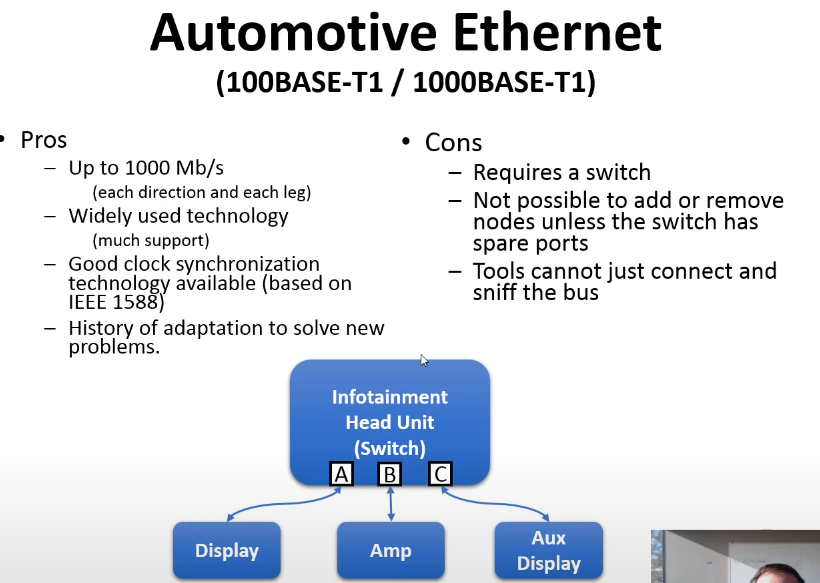
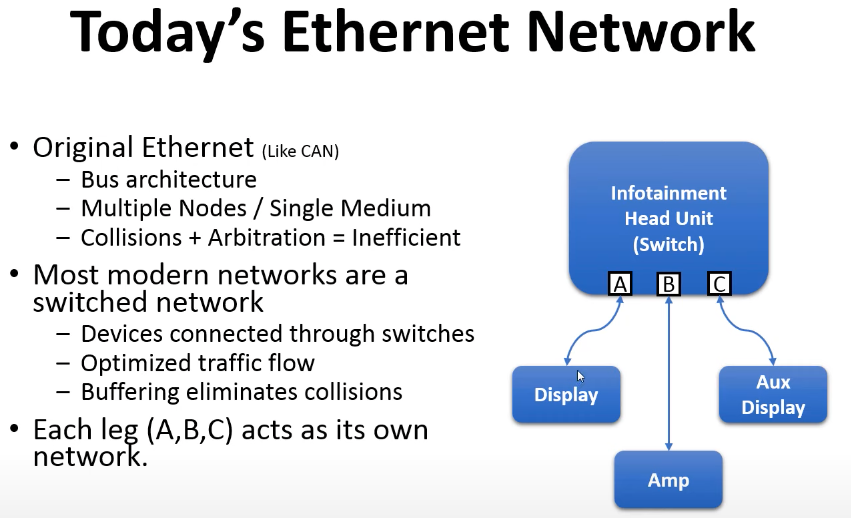
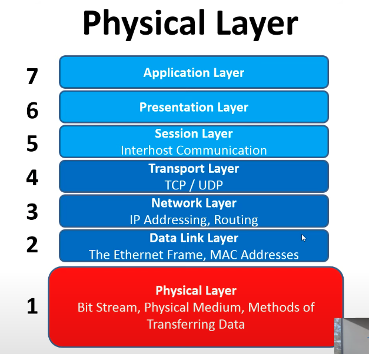
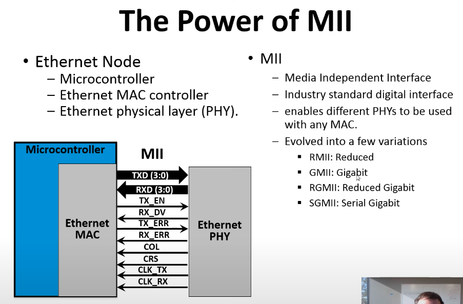
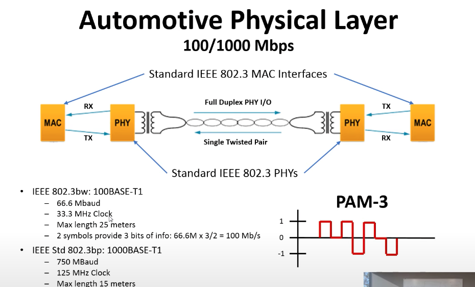
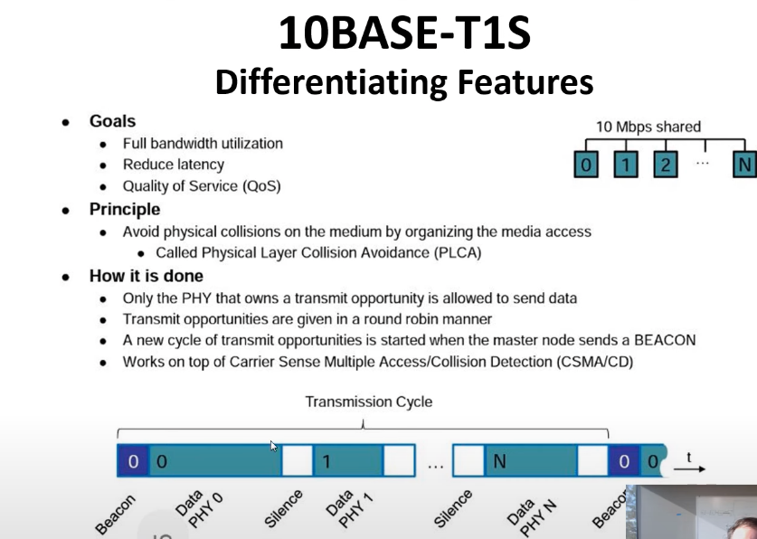
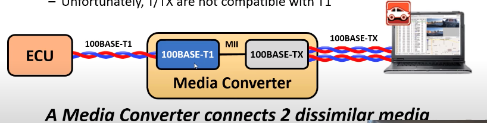
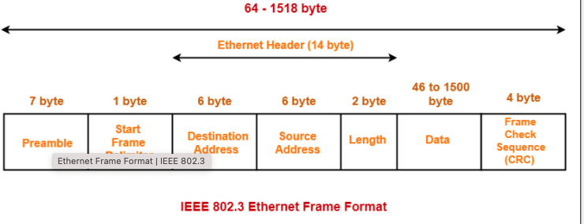
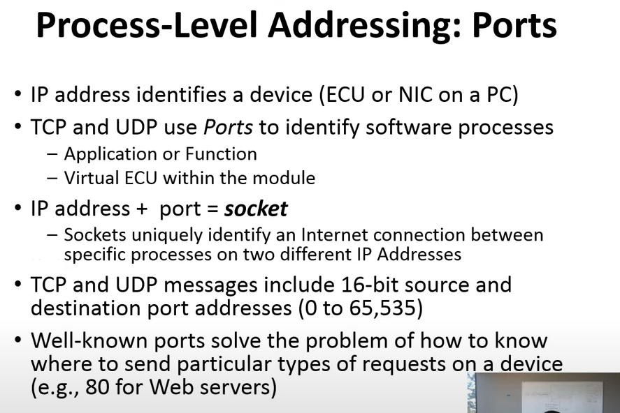
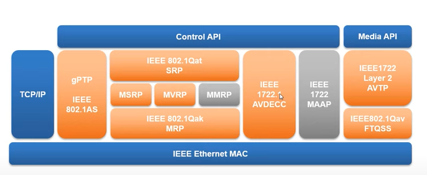

# Automotive Ethernet


**<h1>GENERAL OVERVIEW</h1>**

# 1- Physical Layer


### General Ethernet :

Ethernet is used for `Bandwith`

In vehicles, low power consumption is important. Also , requirement for ECU(Electronic Control Unit) is to be able to comletely wake up from sleep under 100 miliseconds.

Standard 4 wires ethernet cannot handle this speed currently.

So instead of standard ethernet, we use `Automotive Ethernet` which can take care of these issues.


Bus techologies , compared to ethernet, can be more cost effective given cabling prices all through the vehicle.


### Comparing Ethernet to CAN(Controller Area Network) and FLEXRAY

## **CAN**:

it is a multidrop (bus) technlogy where user can add / remove nodes.

Multidrop or bus technology means every node or every ecu is pysically, electrically connected to the same wires as ever other node.


single twisted pair copper wire. => low cost/ light weight
easy for `plug and play`
`Message` or `Packet` based communication.

Unique for CAN is that **`Non-Destructive Arbitration`** for handling message or packet `collisions`.

This is handled in the arbitration section or the arbitration ID of the can network. So when there is a possible collision risk , the arbitration ID is used to identify the message or packet. and the packet or the message with the smaller ID is sent first, whereas the packet or the message with the larger ID is sent later but *`WITHOUT A NEED FOR RE-TRANSMISSION`*.

so lower ID number transmits first, other one waits, not not getting killed just waits.
And nodes that transmits the higher ID packet also understands the situatuin and also waits.

This has a drawback: nodes that lost the arbitration (the ones sending the higher ID packet) will have to wait. *this maskes CAN not as time-critical and accurate in time*.

This is why FlexRay was developed

## **FlexRay**:

it is similar to CAN in terms of wiring. it is a *MultiDrop* technology BUT `all nodes must be pre-programmed wit a fixed configuration`

up to 10Mb/s. speed.
also good for plug and play.
message or packet based communication.

==> *Collision avoidance is based on time slots for each node*

Eveyn node in FlexRay is aware of time base so this helps each node to understand when it is allowed to transmit. So basically there is a cycle time, and it is divided into slices and each node has its own time slot where it is allowed to transmit.
So colisions dont happen in flexray.

This helps very accurate in time and security critical.


## Automative Ethernet :

*(100Base-T)/(1000Base-T)*

==> base means this is the speed at the slowest rate
==> T1 means single twisted cable

Modern ethernet technologies, be it automotive or not, is NOT a bus technology anymore. Instead, it is *point-to-point technology.* This means that each node is connected to only one other node.
for multiple communication, we need to introduce a `SWITCH`.

Switch distributes the traffic to the nodes within a network based on their `pysicall adress` that.

Today commercially there are 100base and 1000base ethernet, 100 meaning 100Mb/s, 1000 meaning 1Gb/s.

Note that automotive ethenetnet is very cost effective network but not enough for `uncompressed audio and video streaming` since they handle around 10MBits.





In bus technology, all the node load can be used and it is  locked to 100 or 1000 mbits. in ethernet, however, it is not the case, aggregate bandwith can exceed 100 or 1000.

## Networking Topologies :

- Defines how device are connected to each other.
- Defines how the device communicate with each other.
- Determines network characteristics.
- Simple Technologies:
- - Point to Point(port) 
- - Ring (Also Etnernet, used for safety critical technologies)
- - Star (ethernet) like one switch with many ports
- - Bus (chained or attached) like CAN , FLEXRAY
- Complex topologies can combine these(like mesh)


#### Hierarchical Star topology :

also known as `tree` topology, where each star topology represents a node and they are also intercoonected to each other via a switch.  you can add / remove nodes without effecting the rest of the nodes.


====***=====

Note that today's ethernet network are a `switched network`, devcices connected through switch, it optimizes the traffic flow, buffering eliminates the colisions.




In this pic , there are three ports (A,B,C) and physically A is connected to only it's corresponding Port(Display), same for B and C. and Under each node, it works as a separate network.
This eliminates the possibility of colisions because each node is communicating through only one dedicated port.


(this is the difference between this and CAN/FlexRay)


### OSI Model



Automotive ethernet, compared to normal ethernet, proioritizes the Physical layer of OSI model.




- Ethernet PHY = Physical layer
- MII = Media Independent Interface
- Ethernet MAC = Media Access Control

MII is connected to Ethernet MAC. 

*Punchline: Why Ethernet is Used and how it changes between regular vs automotive* 

```
MAC stays constant and all the layers under Pyhsical layer are also stays constant. This MAC table, once connected, hosts all the addresses etc and statically keeps these. So it gives ability to easily swap the Ethernet PHY and MAC stays the same, also all the other layers are intact.

This gives ability to change and adapt overtime.

Automotive internet is an adaptation of it where only the physical layer is changed.
Hence talking about `Automotive Ethernet` basically meaning a change in the Pyhsical layer only
This is adaptability and flexibility for the thanks to Ethernet!
```

====***=====

#### Consumer Ethernet Media:

Coax ==> 100Base-2 ==> half duplex ==> obsolete in commercial, used in industry for `DiagnosticsOverIP` purposes. (OBD port)

10/100 Ethernet 100MB/s ==> 10/100BASE-TX ==> full duplex => 2 twisted=4 wires.

Gigabit Ethernet 1Gb/s ==> 1000BASE-T ==> full duplex => 4 twisted=8 wires.


====***=====




in Bus systems like CAN, FLEXRAY, there is a `binary` state at a given time on the pyhsical layer. Whereas in ethernet, more than 2 logical states can be passed. In Gigabit ethernet this is 5 different states(PAM-5). In automotive physical layer of 100/1000mbps,  there are 3 different states(PAM-3). 

Operates at base frequency of 33.3 MhzClock.(Gigabit on automative operates at base freq of 125Mhz)

#### Gotcha Points :
Why Ethernet is good over bus topologies?

1)  Ethernet is, DC-wise electronically isolated. So it is either capacitive coupled or transformer coupled. (capacitive or transformers are used to bridge)

This is another point why ethernet is so dominant in the industry. Because you can have lots of ground differences in and around the network and ethernet remains unaffected.

2) *Point2Point* ethernet is, in all moderns forms are `duplex` which means one node can communicate data in one direction `at full speed` and `at the same time` the other node can communicate data in the other direction `at full speed`

Which means, lets say 2 nodes communicating in two-directions in full speed, at 100BaseT connection, it makes 100 * 2 = 200 Mbit per second data transfer. as for gigabit, thats 2 gbits aggregate data.


====***=====


*A newer Ethhernet Technology that is getting commercially Available nowayays:*

#### 10Base-T1S

- This is an ethernet technology that is A BUS TECHNOLOGY, and created to compete CAN.

- To take advantage of cost-effectiveness of Bus technologies, this etthernet type is created.

- 10Base-T1S means `10 Mbit/s` and `single twisted cable` but `sitting on a bus topology`

- works very closely to FlexRay, using transmission cycle time, in each cycle a beacon is signalled and every node cross-checks its own time based on the beacon. Once it sees its own beacon, it transmits data.

- Puncline is : 10Base-T1s is a `time divided type of network` and this is how it avoids colisions.




====***=====

#### Mixing Pyhsical Medium

It is possible to mix the two technologies, for example, 1000Base-T and 100Base-TX(standard known ethernet in every laptop).

- T implies 8-wire and backward compatible with 4-wire media(TX)
- Auto negotiation resolves the speed since two components have different speed rates.
- Does not work for all media, like optical cable into electrical connector.
- T/TX is are not compatible with T1
- So plugs are not compatible. Needs a media converter and `MII` in between.




***!!!!*** 

***All these things so far are differences between standard ethernet and automotive ethernet and differences live in OSI model layer 8, which is Physical layer. Everything above Layer 8 (7..1) are the same under the hood.***


====================***====================


# 2- Data Link Layer

In data link layer lives the Ethernet Frame and MAC Addresses.

### The Ethernet Frame:

the lowes level structure to carry all data the data on Ethernet to meet the neetds of Layer2.

- Device Addressing
- Message Formattings
- Error Detection
- QoS (Quality of Service)


=> Frames can carry 46 to 1500 bytes of data.




Ethernet Frame architecture:

-> **Preamble** holds 7 octets which helps the syncronization with the rest of the data.

-> **Start of Frame** is a 1 octet field which is used to identify the start of the frame.

-> **Destination MAC Address** is 6 octets, unique. that is the first information that is transmitted and used. Also called the `Physical Address of the Network`

-> **Source MAC Address** is 6 octets, unique. Who transmits the message. 

-> **802.1Q Tag** is 4 octets, optional. VLAN Tag. in most cases expecially in WWW it is not used. but in `Automative Ethernet` especially in real-time transmission and protocols that use this real-time transmission do use this for `Routing and QoS` purposes.

-> **EtherType** is 2 octets, identifies the type of the message. Essentuially just a number, that represents the type of data that is coming next in the `payload`. A very common type is `0x0800 for IPV4.` So means the next octet is the first octet of the IPV4 packet.

-> **Payload** is the data that is being transmitted.

-> **CRC** is 4 octets, CRC stands for `Cyclical Redundancy Check`,  makes sure that the receiver received all the prior bits in the correct order. **NOTE THAT** if a receiving node receives a frame with a bad CRC like short frame, long frame or a fragment of a frame, it **should** drop the frame and don't tell anybody that you dropped it. So in the low level ,there is no re-transmission. We handle this problem in ethernet with higher level protocols which will come soon down here.


A Comparison: In a given time of 110 miliseconds, the ethernet can transmit 12.336 bits at 100mbps whereas CAN can transmit only 8 bytes of data.

wow!


### 1) MAC Address:

MAC address is Low-level/pyhsical address of the network.

Example (00-17-4f-08-5D-69)

- Programmed into hardware devices,
- 6 bytes loing,each node globally unique.
- First 3 bytes is a Organizationally Unique Identifier(OUI)
- **in AutomotiveEthernet, MAC Address = Ethernet Address.**

#### Unicast Addresses:

Point2Point adresses, used to send data to `specific` node. 
-> `Universally Administered Addresses` ==> UAA : globally unique.


-> `Locally Administered Addresses` ==> LAA : probably not unique outside an `engineered network`


#### Multicast Addresses:

-> One to Many addresses.

-> Specific MAC address that **certain** NICs are programmed to accepts.

-> USed for protocol, process, or vendor specific messaging.

-> LSB of the first octet is 1. (01:xx:xx:xx:xx:xx)

-> When MAC address is all 1's (ff:ff:ff:ff:ff:ff) this is called `Broadcast Address` which is a special case where **all** NICs are programmed to accept the message.


### 2) VLANs (VLAN Tag && EtherType)

QoS at layer 2 hardwqare.  Virtual Lan means, I want to `virtually` separate the traffic in a network so that I can get practicvally multiple networks that are `logically` separated on the `same pyhsical network`.


Ports assigned to Virtual Lans. 

-> Switch enforces forwarding restrictions based on VLAN config.
-> VLAN traffic is blocked on ports not `a memeber` of that VLAN.
-> Used to optimize bandwith use with `least` resources.


**Common Automotive Ethertypes**

this is how ethertype is able to handle multiple types of data and their transmission simultaneously on the same network while keeping data consistent.

Note that these are sent in the ethernet packets.

```
General Use: 
0x0800 for IPV4
0x0806 for ARP
0x86DD for IPV6
0x8100 for VLAN (single tag)
0x9100 for VLAN (double tag)
0x88F5 for Multiple VLAN Reservation Protocol


AVB:
0x22F0 for IEEE 1722
0x88F7 for generalized precision Time Protocol
0x22EA for Multiple Stream Reservation Protocol

V2X:
0x88DC for Wave Short Message Protocol
```

==> AVB's are used to create custom ether types.


### 3) `Frame Check Sequence (CRC):

Cyclical Redundancy Check. If fails, packet is dropped by the switch or Ethernet MAc. 
`No built-in Error recovery like CAN` ==> `But this is implemented in higher layers like TCP`


### - Switches

Switches make intelligent decisions predominantly on the MAC address but also on VLAN tags, and also based on the ethertype and the data within the payload of a mac frame.

Enables Layer2 Quality of Service (QoS) by:
-> dropping bad frames.

-> VLAN enfrorcing/managing.

-> Traffic prioritization.

-> Ingress Limiting

-> AVB/TNS protocols.

Conserves bandwith by intelligent forwarding based on the MAC address.
-> Each pyhsical port connection indepoendent.

-> no collision.


Switch routes the traffic in and out of its ports. By definition, ethernet is point2point network. So using switches we can extend the capability of the network.

Also enables multiple streams of data within the same network ( audio, display, console, etc) without speed bottleneck since all streams use their own bandwith. So Aggregate data is not limited to say 100mbits which is not possible in bus-topology networks.


**Intelligent Frame Forwarding**

`Ethernet Switches` all internally have adress tables this is how they know how to route the traffic.

- L2 Address Table:
- - Used by Address Translation Unit (ATU) to translate the MAC address to the port.
- - Table of Address/Port pairs.


- Information Stored:
- - MAC address
- - VLAN ID
- - Destination Port Vector(DVP)(bit array of ports for the MAC)
- - Static or Learned
- - Priorities


So when a source sends a packet, it HAS TO add its source MAC address in the frame hence, it advertising which MAC adress(es) are on the particulat port. then the switch will know which port to send the packet to thanks to the L2 Address Table.

adress table can be static or dynamically learned by the switch. There can be multiple mac addresses per port if you have multiple switches connected to each other.


**Unmanaged and Smart Switches**

- No official Delienation of ports.


**- Unmanaged Switch:**

Simplest kind. A basic MAC adress table is used.

- - Little or no configuration.
- - MAC based routing.
- - Learns L2 address table
- - Floods unknown DA's
- - Possibly stataic L2 address table config.

**- Smart Switch:**

Enables VLAN and thereby enables different priorities based on VLAN tags

- - Basic VLAN support(Static config, enforcing tag/priority)
- - port mirroring

**- Managed Switches:**
Most sophisticated kind of switch.

- - Enhances QoS and Security
- - Addition of host processors or embedded cores.
- - Firmaware esxecures protocols:
- - - Dynamic VLAN management(DMRP)
- - - Manage Redundant Paths(Spanning Tree Protocol)
- - - AVB/TNS protocols

- - Other Advanced Features:
- - -Deep Packet Inspection(make decisions based on IP adress or ether type)
- - - Inggress/egress Policing and limiting.


In the automotive industry we find smart and managed switches.


# 3- Network Layer:

Ip Addressing / routing.

Why need for higher protocols? What inherent problems with ethernet?

MAC addresses tied to `hardware`, much like CAN frames. So :

1) what is you move a server to new hardware with a new MAC address?

2) What is the receiver is not ready or has `limited buffer size`?

3) What if the same pyhsical address is running `multiple logical programs?`

Also :

an Ethernet frame is huge, 1500 bytes.

Ethernet is `lossy`:

1) no guarantee frames arrive in order

2) no guarantee frames arrive at all


`IP` Addresses are called `logical` addresses.

If ethertype in the packet is ipv4 or ipv6, then in layer 3 starting in the payload we have an `IP header`

`IP header` contains information of the protocol(TCP, UDP, ICMP, etc) and the destination and source IP addresses.

What to understand is: `Layer x is encapsulated in layer X-1` mesela Layer 2 frame encapsulates Layer 3 frame. (like onion approach)

each time a layer is passed, you peel a layer off the packet and process it , and peel again to send it to nexty layer.


#### IP HEADER:


-> Version : 4 or 6

-> IHL : Internet Header Length (number of 32-bit words in the header)

-> DSCP : Differentiated Services Code Point (traffic management)

-> ECN : Explicit Congestion Notification    

-> Total Length : Total length of the packet in bytes 

-> Time to Live

-> Protocols: 

- - 1 : ICMP (Internet Control Message Protocol)
- - 2 : IGMP (Internet Group Management Protocol)
- - 6 : TCP (Transmission Control Protocol)
- - 17 : UDP (User Datagram Protocol)

-> Identification : Unique identifier for the packet

-> Flags : Flags

-> Header Checksum : Checksum of the header

-> Fragment Offset : Fragment offset

-> Source and Destination IP addresses


# 3- Transport Layer:

UDP/ TCP




PORTS: 

- Logical Ports:

- - Layer 4 concept to differentiate logical connections.
- - Port + IP address == socket.

- Physical Ports:

- - Connection between PHY and Pythsical Media

- - `Port` on a switch 

- - `Port` on a computer.


It is all about context. for example are these referring to a physical port or a logical port?

- The switch needs to be configured to forward the desired ports for your application : Switch= layer 2, must be physical.

- The router is setup for port forwarding. Router= layer 3, must be logical.

- The server is connected to wrong port : Needs more information.


#### **UDP/ IP:**

Side note :

ipv4 => 4 bytes
ipv6 => 128 bit

Lighter than TCP.,
unreliable by design.
- - No guarantee of order.
- - No guarantee of delivery.
- - Used where timely delivery is more important then serviec guarantees like video streaming.
- - Connectionless.

Analogous to a CAN frame.

- No acknowledgement form recipient ( fire and forget)

- Usually no special recipient ( multi or broadcast)

- Easy to `map` CAN messageing over to Ethernet with UDP

Header consists of : 

16 bits source port (katman 1)
16 bits destination port (katman 1)
16 bits length (katman 2)
16 bits checksum (katman 2)
and then followed by data.


0         16       17             32 
Source Port        Destination Port

Length             Checksum

DATA DATA DATA DATA DATA DATA DATA


#### **TCP/ IP:**

- Full-featured transfer protocol.
- TCP turns ethernet into reliable, dconnection-oriented stream.
- Analog in CAN is ISO-15765-2.

- Unlike other protocols, TCP has the native concept of connection.
- - SYN SYN/ACK ACK thing.
- - Creates an implicit client/server model
- - web browser is a client, web server is a server.
- - delivery IS and guaranteed.
- - order is guaranteed.


======================


### AVB STACK Components:



AVB stances for `Auido-Video-Bridging` which is important for real-time and replayable streaming.
These protocols operate in parallel to everything we talked about so far and are separated by ethertype.


AVB protocols are like : 

IEEE 802.1Q VLAN tagging 

or

 IEEE 802.1AS clock sync. in GPTP there is a grandmaster clock that sends out clock info and other nodes sync to it.
Some other protocols are like IEEE 1722 which tells how to transport audio and video itself like mp4 or mp3


AVBs in automotive industriy are taken and extended to inculde things for `safety critical real-time control` 


========================================================================================================================


**<h1>COMPARING IN VEHICLE NETWORK TECHNOLOGIES</h1>**


Networking considerations:

- Topology : Simple vs complex.

- Message collisions

- Addressing of nodes.

- MEssage / DAta identification.

- Redundancy.

- Time sync across network.

## **Vehicle Networking Applications**

- **Safety/Time Critical Data: **

Requires relative high-speed, >10mb/s with `good time sync` and redundancy. like steering,breakes, ADAS.

- **Control Data:**

General purpose for controlling of actuators and sensors, generally `packed` data, 
Powertrains. like Engine, alternator, transmiission, battery management

- **Backbone:**

General purpose for transporting ** data from one system to another**, generally packet data, `Gateway`s. So from one subsystem to another data transfer like from control data to safety data.

- **Infotainment:**

Streaming audio/video data critical. Requires good sync and control data, `high speed > 25mb/s` like GPS, Radio, Video, Camera

- **Low-Cost/Speed Data:**

as cheap as possible for slow speed non-safefy control: door switches, lights,climate, seat etc.


- **Multi-Giga Data:** 

Currently very high bandwith for `point to point` networks


## **POPULAR VEHICLE NETWORKING APPLICATIONS**


from cheaper + slowest to most expensive + fastest

## **LIN - LOCAL INTERCONNECT NETWORK**

Can be used for non-critical applications.

Pros:

- Very low cost with single wire copper cabling.

- MultiDrop topology(Bus) so every ECU is electrically connected to every other ECU.

- Easy for plug and play.

- Master ECU controls the timing for transmissions of other ecus.(master-slave)

- TDMA- Time Divided Media Access to aviod collisions.


Cons:

- Very very low bandwidth with 20kbps

- Small payload max 8 bytes

- No common time base accross network.


## **CAN - CAN-FD - CAN-XL**

CAN = Controller Area Network.

One of the MOST COMMON,  if not THE most common.

Used in `Low-cost/Speed data, Backbone, Control Data.`

Pros:

- Low cost single-twisted pair copper cable.

- most widely used well proven Automotive Networking Topology

- MultiDrop topology(Bus) so every ECU is electrically connected to every other ECU.

- No master-slave, they can transmit at any time.

- Easy for plug and play.

- `non-desctructive arbitration` for data transmission and collision prevention. Network Controller decides who wins based on their Arbitration ID.


Cons:

- Limited bandwidth with 10Mbps with `CAN-XL` (also due to non-destructive arbitration)

- Relatively small payload with max 8 bytes with CAN, 64 bytes with CAN-FD and 2048 bytes with CAN-XL

- No common time base accross network.

- no inherent redundancy and time sync.


## **FlexRay**


Used in `Safety/Time-Critical, Backbone, Control Data.`

Pros:

- Single twisted pair copper cable.

- MultiDrop topology(Bus) so every ECU is electrically connected to every other ECU.

- `inherently redundant and deterministic`

- compeletly new message scturcure.

- clock syncronization deterministic(static frames)

- TDMA- Time Divided Media Access to aviod collisions.

- fixes problams with CAN.

- With every FlexRay chip, a redundant controller built in.


Cons:

- must design the entire network at one time.

- all nodes must be aware of and programmed for the entire network design.

- Max baud rate 10Mbps.
