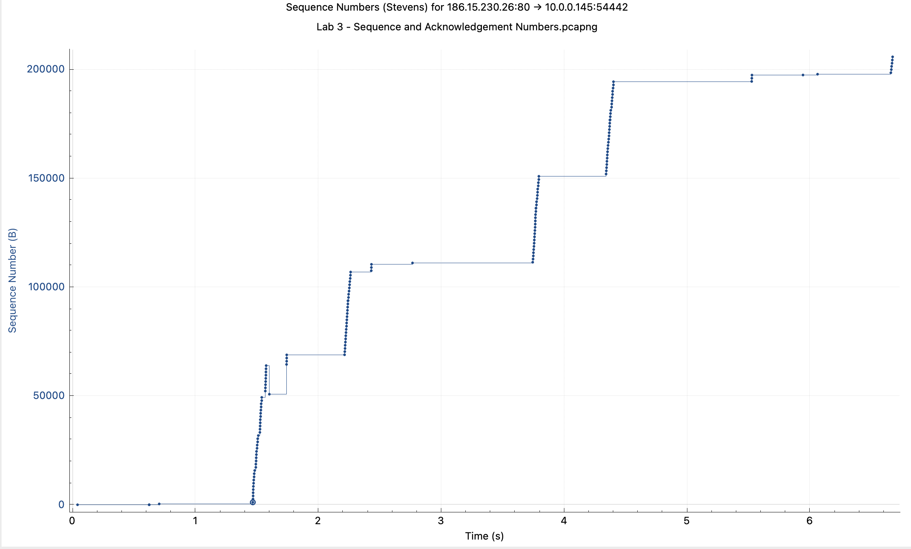

# **<h2>MODULE 1 Analyzing Network Protocols With Wireshark</h1>**

Packet that Matters:

 Best way to begin capturing network traffic is collecting our analysis on a span mirror port on a switch near the client.

 This will help to keep the traffic flowing and to avoid the traffic being captured by the switch hence making it smaller and easier to analyze.

Another way to create a smaller haystack is to filter the captured traffic to only the traffic that is relevant to the analysis.

We create custom columns, protocols, and custom filters to help us analyze the traffic.

Also saving protocol filterings as button for the quick access to those filters.

## **Core Protocols**

Under the application data there are :

- UDP
- TCP
- IPV4
- IPV6
- ARP
- ICMP
- DNS
- TLS

### **Custom Profiles**

Right click on down right on profile and select "New" and then create the custom profile.

After creating a new profile: go to edit and preferences to start customizing the profile.

Right of the bat: adding Delta time to the profile as title `delta` and type `Delta time displayed` to show the time difference between the packets.

 Another way is to right click on any value down and click `add as column` to add the value as a column.

#### **Creating and Saving buttons.**

There are some filters that you keep using but you dont want to keep writing them. For example `tcp.flags.syn==1` which is the syn=1 flag where the communication starts.

in order to add it as button, I write this on the filter box and click on `+` to add it as a button.

it is also important to colorize the packets in order to create the visibility. view==>colouring rules, then write the filter you want to filter (like regex) and then do not forget to enable it. Also change the importance level by dragging up and down in the list.

**<h1>PROTOCOLS IN DETAIL</h1>**

**<h2>1- ARP</h2>**

**NOTE THAT** ARP does not resolve IPV6 addresses. Meaning IPv6 does not use ARP.  IPV6 uses NDP(Neighbor Discovery Protocol) to resolve the addresses which replaces ARP.

Address Resolution Protocol (ARP) is a protocol used to resolve the MAC address of a host. meaning, it bridges the gap between layer 2 and layer 3.

ARP ne ise yarar nasil calisir?

Bir packet gonderecegin zaman, header olusturmak icin destination IP ve MAC address ihtiyacin var. sen baslangicta kendi IP ve mac adresini biliyorsun, bir de serverinkini.

Target'in MAC adresini bulmak icin ARP kullanilir. ilk once local arp cache'e bakar. eger varsa direkt cevap verir. eger yoksa `arp request` gonderir. Networke bunu broadcast olarak gonderir.

Bu broadcast domain icindeki devices will take this up, will check the IP address that is being resolved and will build and send a reply with  its own mac address as the source mac address.

Yani aslida soyle:

18 numarali bilet kimde ogrenmek istiyorsun. Elindeki listede varsa zaten sorun yok, yoksa ortaliga bagiriyorsun `18 numarali bilet kimdee` yani `what is the mac address for this IP address`?

Herkes biletine bakip `benimki x`, `benimki Y` diye  cevap veriyor.

Sen de sonunda ogrenmis oluyorsun ve header'i yaratip gonderiyorsun.

==> Arp requests are broadcasted to the network but responses are unicasted to the sender.

You check the ARP protocol if you see:

- Problems connecting to an application
- intermittent connectivity.
- Unicast flooding.

If the destination is visible (like Apple or Google,) it means that the destionation was on the Arp Cache already so it is not broadcasted but unicasted.

**Hands on Demo**:

**Lets disect a ARP request:
**

```
Address Resolution Protocol (request)
    Hardware type: Ethernet (1)     
    Protocol type: IPv4 (0x0800)
    Hardware size: 6
    Protocol size: 4
    Opcode: request (1)
    Sender MAC address: BelkinIn_9d:02:73 (94:10:3e:9d:02:73)
    Sender IP address: 192.168.10.1
    Target MAC address: 00:00:00_00:00:00 (00:00:00:00:00:00)
    Target IP address: 192.168.10.108
```

- Hardware type = Ethernet

- Protocol type = IPv4  Meaanign trying to resolve a mac address to IP address.

- Opcode = 1  meaning request

- Target MAC address: 00:00:00_00:00:00 (00:00:00:00:00:00)   so this is the information that is missing and being looked for. 00:00:00... means that the target mac address is not known.

- Target IP address: 192.168.10.108 is the IP address that is being looked for.

**Now lets look at the ARP Response to this request:**

```
Address Resolution Protocol (reply)
    Hardware type: Ethernet (1)
    Protocol type: IPv4 (0x0800)
    Hardware size: 6
    Protocol size: 4
    Opcode: reply (2)
    Sender MAC address: Apple_e7:ce:6d (a4:5e:60:e7:ce:6d)
    Sender IP address: 192.168.10.108
    Target MAC address: BelkinIn_9d:02:73 (94:10:3e:9d:02:73)
    Target IP address: 192.168.10.1
```

- Opcode = 2  meaning reply

- Sender MAC address: Apple_e7:ce:6d (a4:5e:60:e7:ce:6d)   so this is the mac address of the sender which was missing.

- Sender IP address: 192.168.10.108

As you can see, sender and target IP addresses match, so the ARP reply is valid and MAC address is resolved.

In some cases we see some weird ARP requests that sends requests for entire network. like couple hundred or maybe more limited or less limited numbers of ARP requests.

This `could be` and indicator to an attack.

The first thing to do is to check the IP origin of the ARP request. For that end, I will create a ARP profile in the wireshark.

as a new coulumn, I will add the `opcode` field which will filter requests and responds. that would be interesting in this case to see if there is any active subnets and actualy any response.

Here is the filter : `arp.opcode==2` This will show all the packets that responded to the requests.

Another very interesting filter is `arp.isgratuitous` which means that we are looking for arps that are  gratuitous either as requests or replies. Grattuitous means that the sender and target mac addresses are the same. Meaning sending its own IP and Mac address which means advertising itself.

Once we know that all is fine, we can remove any protocol that is not needed in the trace. For a protocol to be removed we use `!{protocolName}` like `!arp`.

**<h2>2- IPv4, IPv6 ve ICMP</h2>**

Unlike ethernet, IP is a end to end protocol not a point to point protocol.

`192.168.1.8` is an IP address, `255.255.255.0` is a subnet.

IP header holds the information about the packet like version, header length,`DSCP(Differentiated Services Code Point)`, ECN(Explicit Congestion Notification), total length and so forth. Many of the times we will be dealing with `DSCP` part of it to troubleshoot where markings for the packet prioritizing is made.

Another important part is total length whici is the total amount of encapsulated packet including the header itself.

Next is the `identification` field which is used to identify the packet, it is either randomized or sequential which is used to `uniquely id` a packet from a station.

Helps figure out whether a packet is duplicated or not, and also help track application traffic behind a load balancer.

`flags` field helps to understand whether the packet is a fragment or not. or fragmentation is allowed or not.

`Time to Live` layer helps to see how many routers/or layer 3 switches a packet has hopped through on its way to destination.

`Protocol` field shows which protocol is coming next in the data payload. It could be TCP, ICMP, or other.

**IP Fragmentation**

Sometimes there is so much data that it is not possible to send it in a single packet.

Lets assume you are sending a data of 1500 bytes. But VPN tunnel has `MTU` 1400 bytes and rest is reserved for encapsulation. As long as the data is less than MTU, it can be sent in a single packet but if it is greater than that, `flags` field will be checked. If the flags are set to `MF` then it means that the packet is fragmented and needs to be sent in multiple packets(called fragments). Each fragment then holds in their header field on how to reassamble the packet.

Sometimes, like in encrypted traffic, the packet does not want to be intercepted or dissected.

If packet size is big and MTU is lower than that, and also `do not fragment` is set, then router will send an `ICMP` error message to the sender saying it cannot pass the packet.

**TTL**

For example when you ping to someplace, it gives you the TTL number.(like 51)

***TTL is not a function of time, it is a decrementing counter!!.*** As the packet travels through the network, each router decrements the counter by 1. If the number is reduced to 0, meaning the packet has reached the destination, it will be dropped and ICMP error message will be sent back to the sender.

This works in both directions in the same manner. This way, we can estimate how many routers are there in the network.

These days TTL starts either at 255(cisco/solaris), or 128(windows), or 64(linux)

**Understanding IP TTL**

Questions based on a Pcap file(`IP TTL`)

- 1. How many unique IP stations are transmitting in this trace file?

go to statistics==>endpoints tab and do not count them manually!

- 2. How many unique IP conversations are there in this trace file?

go to statistics ==> converstaions and do not count them manually!

- 3. What conversation is the busiest? (By bytes)

in statistics ==> conversations, sort them by bytes. (104.17.208.240=192.168.10.108) was the busiest.

- 4.Set a filter for the conversations including address 104.19.162.127. How many packets match that filter?

set the filter `ip.addr==104.19.162.127` and on the lower right side is the visible.

- 5 What side of the conversation was this trace file captured on? Client or server? How can you tell?

we loook at the `info` column, `source` and `destination` columns.

they generally give an idea based on the ports (lets say destination port is 80, then it is a client side conversation)

A robust check would be to check the first packet, and take a look at the IP TTL. in my case, it is 64. **The reason for picking the FIRST packet is to capture the iunitial value of TTL becasue a random packet with TTL 64 or say 50 could belong to any possible TTLs of 255,128,64 but the first packet's ttl will give the initial counter number.**

Then I check a packet on the opposite direction(source,destionation places are changed.) then I see TTL is 51. This tells me that the `SERVER is 13 HOPS AWAY`!!
`

because initial counter - current number = 13.

I know this is captured from client side.

REason 1: I dont have routing packets on the outbound direction.
REason 2 : I do see coming back packets from the server.

Another way to know is to look at the delta time.

Inbound and outbound packets for the same IP alinir. aralarindaki delta time'a bakilir ki bu bizim ornekte 0.46ms. bu kisa bir sure. Sonra 2. packet'in infosuna bakilir. infoda `[SYN,ACK]` yaziyor. bu da clientta oldugumuzu gosteritor.

- 6.  Is there any prioritization in traffic coming from the server? What priority marking is used?

 I pick a packet coming from the server, open the `Differentiated Services Codepoint` and check if any marking. in my case, there was the marking `Assured Forwarding 11` so it says the packet is not going to be intercepted and dropped.

- 7.  What IP flags are set on traffic coming from the server?

 again, pick a packet coming from the server and open the `Flags` section. in my case it is `0x4000` which means `Don't Fragment`

- 8 Is the client using incrementing IP Identification numbers? or is it randomizing them?
Pick 2 client packets coming one after another and check the `identification` in both of them. if the numbers are consecutive, then it is incrementing. if not, then it is random.

**IP Fragmentation in action**

I can use a filter and filter out all the packets with size 1500 and above. once filtered, in the infor section of the packet wireshark will say `Fragmented IP protocol`. Once I open the packet and check the **DSCP** field, it is set to 0000 00. More importantly, in the `Flags` segment, the flag set is `more fragments` meaning although the size of this packet is 1500, more packets are to follow.

`Fragment offset` field gives me the place of the packet in the total packet. (in my case was 0 meaning the first fragment.)

This is all possible due to `do not fragment` flag.

**ICMP**

Internet Message Control Protocol is a messaging suite used to send error messages to the sender. Used by both endpoints and infrastructire.

- outages
- network problems,
- routing problems
- port unreachable/ unavailable and more.

You send a SYN packet to server. Gateway is problematic and does not have a route to destination network. So it sends an ICMP error message (`Destination Unreachable`) to the sender.

Another way ICMP is used is during fragmenting a packet. Lets say ytou are sending a packet of 1500 bytes BUT flag says `Do not fragment` however MTU on the router is 1400 so it NEEDs to dissect the packet but it CANT. so it will reply with an ICMP error message(`Destionation Unreachable Fragmentation Needed`).

 An ICMP packet :

 ```
 Internet Control Message Protocol
    **Type: 8 (Echo (ping) request)**
    Code: 0
    Checksum: 0xe275 [correct]
    [Checksum Status: Good]
    Identifier (BE): 34209 (0x85a1)
    Identifier (LE): 41349 (0xa185)
    Sequence number (BE): 0 (0x0000)
    Sequence number (LE): 0 (0x0000)
    [No response seen]
    Timestamp from icmp data: Oct 28, 2019 22:00:31.237036000 +03
    [Timestamp from icmp data (relative): 0.000056000 seconds]
    Data (1592 bytes)
 ```

Some ICMP types:

- 0: Echo reply
- 3: Destination unreachable
- 5: Redirect
- 8: Echo request
- 11: Time exceeded(TTL Exceeded)
- 12: Parameter problem
- 30: Traceroute

Undear each type are codes that correspond(for gfiving more detailed error.)

LEts say the types is 3, `Destination Unreachable`.  These are the possible codes:

- 0: Network unreachable
- 1: Host unreachable
- 2: Protocol unreachable
- 3: Port unreachable
- 4: Fragmentation required/ DF set
- 9: Network administratively prohibited

Let's go over some ICMP questions:

- 1 How many ICMP packets are in this trace file?
 go to display filter, write `icmp` and check the number down the right side.

- 2 What is the Type of ICMP message?

pick the icmp packet and under `ICMP`, you see the type and code.

- 3 What is the code value?

CODE:3 ==> so it is 3 and Port Unreachable.

So that packet went aalll the way through the network, hit the destionation but the port was not open.

- 4 What is the source IP of the sending station of these packets?

in the Source segment of the packet, it is available.

- 5 Why is this(with code 3) ICMP message being sent? Is something broken? If so, what?

we go above the first error opcoded ICMP packet and see the network traffic. in my case, there were 2 requests were made in sub-milisecond to same website on different IP addresses. one was successfully resolved whereas other gave the error. since the dirst one was successful, the other one was not needed anyways and was dropped.

One another way is to look ath the returned ICMP packet itself. nice thing about ICMP is that it shows the packet that triggered the error. check below:

`User Datagram Protocol, Src Port: 53, Dst Port: 39550`

 so this informatiuon actually says that you TRIED to reach port 39550 but it was not open so here is the error.

- 6. Will the user experience any application problems from this behavior?

If there wasnt a subsequent successful connection, then the user would experience a problem.

**IPv6**

IPv4 has 4.3 billion IP addresses, 32 bit. IPv6 has 340 trillion trillion IP addresses, 128 bit.

lets take a look at a IPv6 address:

`2001:4860:4860:0000:0000:0000:0000:8888`

- 8 blocks of 4 hexadecimal values

- first 3 blocks(48 bytes) are unique network identifier (UNI)

- 4.th block is subnet identifier (SID)(ipv4 uses masks ipv6 uses identifier)

- rest of the 4 blocks are host identifier (HI). used for getting the packet into its destination

if there are multiple 0 blocks, it is by convention written as `::`

so above example would be `2001:4860:4860::8888`

**The IPv6 ADdress Ranges:**

Most commons are:

- Link Local Address Range: `fe80::/64`  ==> local without a router

- Global Address Range : `2000::/3` ==> send `unicast` packet from one device to another

- Unique Local Address Range: `fc00::/7` ==> Router comms within an enterprise(private address space gibi)

Ipv6 is compatible with IPv4 using tunneling.

As for **IPv6 Header**:

first two header values are `Version` and `Priority/Traffic Class` which allows priorizitaion of the Ipv6 packets.

next comes `Flow Label` which works as a label for series of  packets in a single flow to uniquely ID them.

Let's go over some IPv6 packet:

```
Internet Protocol Version 6, Src: 2001:1:2:3::1, Dst: 2001:1:2:3::2
    0110 .... = Version: 6
    .... 0000 0000 .... .... .... .... .... = Traffic Class: 0x00 (DSCP: CS0, ECN: Not-ECT)
    .... .... .... 0000 0000 0000 0000 0000 = Flow Label: 0x00000
    Payload Length: 60
    Next Header: ICMPv6 (58)
    Hop Limit: 64
    Source: 2001:1:2:3::1
    Destination: 2001:1:2:3::2
```

version: 6 ==> ipv6

next we can see DSCP or Traffic Class. ( in this packet there is not one but normally it is expected)

Next is the `Flow Label` which is used to uniquely identify the packets in a flow. IPv6 automatically adds this value to the IPv6 header.

`Hop Limit` ==> how many times the packet can be forwarded. in this case is  this is like TTL in IPv4. and last 2 are source and destination IPs with :: markation.

So as packet perspective, it is not very daunting.

**<h2>3- UDP, DHCP, DNS</h2>**

**UDP**

`User Datagram Protocol` does not require a handshake or establishing a connection. Due to its low overhead, it is generally used for `Time Sensitive applications` **that can handle small amount of data loss**. So time critical but NOT safety critical maybe. It is a very simple protocol without many of the segments that TCP has.

A UDP header consists of the following fields:

- Source Port

- Destination Port

- Length

- Checksum .  

Let's go over some UDP packet and answer some questions:(Based on *Analyzing UDP pcap*)

- 1 . What Applications are using UDP in this trace file?

We can see on the `Protocol` column, DNS and SNMP are using the UDP protocol.

- 2 What UDP port number does the DNS server use?

Opening a DNS application and checking the UDP packet header will show the source and destination ports. Generally, UDP lives on the port 53. This pcap file is not exception to that.

Source: 2085

Destination: 53

- 3 Why do we see the ICMP message in packet 5?

ICMP packet's type is 3 and code is 3 which is `Destination Unreachable, Port Unreachable`.

So there has been a packet that was sent to a port that was not open.

The reason was that, there was a SNMP request made to an IP address on port 161 and that returned no port open as ICMP packet. How Did I know this happened because of the ICMP packet?

Because ICMP's source-destination should be used revereselu in the problematic packet. which was ICMP. then to further check, I checked the destination ports in both packets which were 161 and 161. meaning they were same so ICMP was a response to SNMP packet.

==> **Tip: port 161 is generally used for SNMP anyways.**

That's all for UDP for now.

**DHCP**

Client IP address is assigned by the DHCP server.

Lets say there are 2 hosts with unique MAC addresses , connected to a switch. In order to be able to communicate, they neeed unique IP addresses. DHCP helps assigning IP addresses dynamically from a central pool. DHCP helps these endpoints to discover servers that are offering addresing. So client , using `DHCP discover` asks **Who is the DHCP server?**

DHCP consists of 4 packets:

- 1 ) DHCP discover:  Client *broadcasts* this to the network to find a DHCP server.

- 2 ) DHCP offer: Server sends this broadcast to the client to tell it where to go.

There could be more than one DHCP server in the network so can get multiple offers, client then decides which one to accept.

- 3 ) DHCP request: Client sends broadcast request to decided DHcP server to get an IP address.

- 4 ) DHCP ack: Server sends this to the client to tell it that it has an IP address.

That is the basic of DHCP and how a client gets a new IP address.

There are some extra steps when analyzing the DHCP packets.

**After getting assigned with an IP address, the client wants to verify that it is the only one that is with that IP address, hence sends an ARP request (gratuitous) to the server, if any other client says `I have that IP address too`, then it informs the server saying I need anoter IP address.**

for this end, the client sends an **DHCP Decline** to the server.

Then server marks this as `assigned alredy` and assigns the next available IP address in the dynamic pool.

during the DHCP process, the server will indicate to the client the *length of the lease* and the *time remaining* for the lease. meaning this is the timeframe this IP is valid. After that, the IP will be released to the dynamic pool for reassignment.

anytime during the `lease` the client can send a **DHCP renew** to the server to keep the IP address alive as long as it is available or server tells the client when to request `renew`

Lets go over some questions to better understand DHCP (analyzing DHCP pcap):

- 1 In the DHCP discover, what options is the client requesting?

Beware that the source IP address of the client that sends `dhcp discover` is 0.0.0.0 since it does not have a valid IP address yet.

in the initial discover packet we have the following options:

- DHCP message type: 1 (Discover)

- Client Identifier: that is the MAC address of the client.

- Host name: the name of the client.

- Parameter Request List: the list of options the client wants to receive. in my  case it was  `Subnet Mask` , `Router`, `Domain Name Server`.

- End of options: 0xFF.

- 2. Is this a broadcast packet?

When I look at that layer 2 of the packet `Ethernet II, Src: NetAlly_a1:17:9f (00:c0:17:a1:17:9f), Dst: Broadcast (ff:ff:ff:ff:ff:ff)` it is clearly said that the destination is Broadcast.

- 3.What is the function of the ARPs in packets 2-4?

ARP packets 2-4 are exactly the same packets broadcasted 3 times. asking whether someone has the IP address that the client is trying to get. We assume that not response was given to this packet.(because in packet 5, DHCP will offer this IP to the client.)

**BEWARE THAT WE ONLY ASSUME THAT ARP RESPONSE WAS NOT GIVEN. WHY DO WE ONLY ASSUME? BECUSE ARP REQUESTS ARE BROADCASTED SO WE CAN SEE THEM BUT RESPONSES ARE UNICASTED SO THERE IS A POSSIBILITY WE DONT TAP ON THEM**

- 4 What is the server host name of the DHCP server?

in the DHCP offer packet, the server host name is `ecosystem.home.cisco.com`.

- 5 The server goes above and beyond. What options are offered to the client that did not appear in the discover packet?

One thing interesting is, in the offer packet, there are some options that are not mentioned in the discover packet. these are:

- - Server Identifier: the IP address of the server.

- - IP address lease time: the time the client has to renew the IP address.

- - Rebinding time: the time the client has to rebind the IP address.

- - Subnet Mask: the subnet mask of the network.

- - Broadcast address: the broadcast address of the network.

- - DNS.

- 6 In the request packet, why is there no relay agent?

checking the next DHCP packet(which is sent by the client), DHCP Request, the relay agent is not there. in the packet: Relay agent IP address: 0.0.0.0.

this is a typical behavior, you dont relay yourself, router do that.  we see that relay agent IP address on the way back in the acknowledgement packet.

- 7 In the request packet, how does the client identify which server it wants an address from?

in the options section of the request packet, the client identifies the server using the option `DHCP server identifier`. to which the value is an IP address.

- 8  In the DHCP ACK - is this packet a broadcast?

When we look at the second layer headear (Ethernet II) this is what we see :

```
Ethernet II, Src: BelkinIn_9d:02:73 (94:10:3e:9d:02:73), Dst: NetAlly_a1:17:9f (00:c0:17:a1:17:9f)
    Destination: NetAlly_a1:17:9f (00:c0:17:a1:17:9f)
    Source: BelkinIn_9d:02:73 (94:10:3e:9d:02:73)

```

So destination is clearly specified, hence it is a unicasted packet.

- 9 What is the lease time of the accepted address?

leaase time, rebinding time values are in the options section of the DHCP ACK packet.

in this case it is 24 hours.

- 10 What is the function of packets 8 and 9?

in my trace file, two packets coming after the DHCP ACK packets are ARP requests.

The use of these packets are to verify that the client has the IP address that the server has assigned to it. to they are broadcasting and advertising themselves to the network using gratuitous ARP.

in the first packet, it sends its own mack address and target IP address is it's own IP address. asking `IF anyone else has the same IP address` and the response is not given. the next packet is ARP announcement packet whath is again a broadcast and telling I have this IP address.

**DNS**

Domain Name System is a protocol that allows a client to resolve a domain name to an IP address and vice versa.

Dns is like a phone book of the internet.

Client wants to connect to a URL that IP is not known(not in DNS cache). This request is sent to the DNS server. DNS server looks up the IP address and returns it to the client.

But servers dont hold all the namespaces and IP addresses on their table.

Client first sends this request to its own DNS server which is known as `DNS recursor`. if in cache, it will quicky respond. If not, it will query the `Root Name Server` asking for the TLD (TopLevel Domain) for x.com for example. Root NameServer will reply with the TLD for .com.(it was queried cunku)
Then DNS Recursor will query the TopLevelDomain server for the TLD asking `what is the AUTH NS`. TLD will respond with the next server to go ask.

finally a full request will be sent to Authoritative Name Server. (like www.yavuzyagis.com) This will resolve the query and return an updated IP address which will be set back to client as DNS reply

Yani soyle. Sen bir siteye giriyorsun, IP adresi belli degil ve cache'de de yok. Gidip Root servera basvuruyor DNS server, x.com icin TLD nedir. Root server diyor ki git suradaki TopLevelDomain servera sor. o bilir. seni ozellikle bu TLD serverra yonlendiriyor.

O da soruya cevaben diyor ki, git suredaki Auth NS'e sor. o en updated olanlari tutuyor bu site icin. sonra oraya gidiyor ve cevabi aliyorsun.

Root Nameserver ve Auth Nd burda guide olarak calisiyorlar.

Mesela bir DNS query olsun `pluralsight.com` icin.packet icinde `question` kisiminda questions sorusu bulunur. `Queries` kisminda ise neyi query ettigi bilgisi bulunur.

 Ona cevap olarak gelen DNS query Response asagidaki gibi olur:

```
Domain Name System (response)
    Transaction ID: 0x0767
    Flags: 0x8180 Standard query response, No error
    Questions: 1
    Answer RRs: 3
    Authority RRs: 5
    Additional RRs: 0
    Queries
        www.pluralsight.com: type A, class IN
    Answers
        www.pluralsight.com: type CNAME, class IN, cname www.pluralsight.com.cdn.cloudflare.net
        www.pluralsight.com.cdn.cloudflare.net: type A, class IN, addr *104.16.242.249*
        www.pluralsight.com.cdn.cloudflare.net: type A, class IN, addr *104.16.243.249*
    Authoritative nameservers
        cloudflare.net: type NS, class IN, ns ns5.cloudflare.net
        cloudflare.net: type NS, class IN, ns ns3.cloudflare.net
        cloudflare.net: type NS, class IN, ns ns4.cloudflare.net
    [Request In: 1]
    [Time: 0.163996000 seconds]
```

NOTE: `www.pluralsight.com: type A, class IN` aslinda request body icinde idi. burda onu tekrar yazmis. Typa A meaning IPv4 address.

**<h2>4- FTP , HTTPS, TLS</h2>**

**FTP**

FTP , `File Transfer Protocol` is a protocol that allows a client to transfer files to and from a server.

- FTP provides easy file transfer, clear text on wire, not a secure protocol. username, password, filenames, etc. are sent in plain text.

- SFTP, `Secure File Transfer Protocol` is a secure protocol that provides a secure file transfer. uses SSH.

- TFTP, `Trivial File Transfer Protocol` is a protocol that provides a file transfer without encryption. used within LAN over UDP. Configuration files to network devices.

**FTP under the hood**

- Client sends a request to the server with username and password on the port 21.

- After log in, client asks What directory it has access on the system.

- Server tells the client what folder/folders it has access to.

- Client asks specific files within an directory.

If a client asks for a file `passively` then server tells to the client to connect to this port.

- Then client establishes TCP connection to that port.

- Request is made

- Transfer begins.

Using the PCAP file (Analyzing FTP.pcap), lets answer the questions:

- 1 What port does the client connect to on the server to start the command connection?

On the connection info, the first packet reads : `Transmission Control Protocol, Src Port: 55579, Dst Port: 21, Seq: 0, Len: 0`  directing the request to port 21. so it is 21. Also fom the response, we can see that the server is running FileZilla.

- 2 What initial Login does it use?

On the packet number 6, `FTP Request` packet,

```
File Transfer Protocol (FTP)
    USER anonymous\r\n
        Request command: USER
        Request arg: anonymous
```

We see that user is trying to login anonymously.

On the next packet, the server says :

```
File Transfer Protocol (FTP)
    331 Password required for anonymous\r\n
        Response code: User name okay, need password (331)
        Response arg: Password required for anonymous
```

Then user sends the following packet:

```
File Transfer Protocol (FTP)
    PASS chrome@example.com\r\n
        Request command: PASS
        Request arg: chrome@example.com
```

chrome@example.com being the sent password.

The resonse comes:

```
File Transfer Protocol (FTP)
    530 Login or password incorrect!\r\n
        Response code: Not logged in (530)
        Response arg: Login or password incorrect!

```

One way to follow the conversation in whole rather than packet by packet is to use **Follow >> TCP Stream.**

Here is the full conversation on Follow:

```
220-FileZilla Server 0.9.60 beta
220-written by Tim Kosse (tim.kosse@filezilla-project.org)
220 Please visit https://filezilla-project.org/
USER anonymous
331 Password required for anonymous
PASS chrome@example.com
530 Login or password incorrect!
QUIT
221 Goodbye
```

You can achieve the same thing also using the filter code : `tcp.stream eq 0`

Lets check an established connection example:

Starting with a new TCP packet of connection request, I follow the TCP stream:

```
220-FileZilla Server 0.9.60 beta
220-written by Tim Kosse (tim.kosse@filezilla-project.org)
220 Please visit https://filezilla-project.org/
USER chris
331 Password required for chris
PASS 
230 Logged on
SYST
215 UNIX emulated by FileZilla
PWD
257 "/" is current directory.
TYPE I
200 Type set to I
SIZE /Pluralsight Logo.PNG
213 5817
CWD /Pluralsight Logo.PNG
550 CWD failed. "/Pluralsight Logo.PNG": directory not found.
PASV
227 Entering Passive Mode (192,168,10,196,227,188)
RETR /Pluralsight Logo.PNG
150 Opening data channel for file download from server of "/Pluralsight Logo.PNG"
226 Successfully transferred "/Pluralsight Logo.PNG"
QUIT
221 Goodbye
```

So username is chris, password is empty, and the server is FileZilla. Directory is /.

```
SYST
215 UNIX emulated by FileZilla
```

User is asking what SYSTEM I am on, the response is, well, Unix.

`PASV` means user wants to establish a passive connection.

```
File Transfer Protocol (FTP)
    PASV\r\n
        Request command: PASV
```

can also be seen in the packet body. Then in the response, the server returns a chunk of data including the new port number.

```
File Transfer Protocol (FTP)
    227 Entering Passive Mode (192,168,10,196,227,188)\r\n
        Response code: Entering Passive Mode (227)
        Response arg: Entering Passive Mode (192,168,10,196,227,188)
        Passive IP address: 192.168.10.196
        Passive port: 58300 
```

How do I get this number? check this?

`Entering Passive Mode (192,168,10,196,227,188)\r\n`

after the IP address, there is 227 and 188. so formula is.

(227 X 256) + 188 = 58300

Then a new connection is established on this port:

`Transmission Control Protocol, Src Port: 58300, Dst Port: 55581, Seq: 0, Ack: 1, Len: 0`

Then server sends Data Packets. After data transfer is finished , comes a [FIN,ACK] packet that closes connection and then the connection comes back to port 21.

Using these, we can recombine the packet actually.

click on data, follow tcp stream, on the show and save data as , select `RAW` and voila, recombined the packet and data.

**HTTPS and TLS**

HTTPS came in 2000 using encryption over TLS.

Then in 2015, HTTP 2.0 came out and multiplexed req and res. Meaning sending multiple requests at once in a single TCP connection.

in 2019, HTTP 3.0 came out started to use UDP transport.

How does HTTP (not HTTPS) work?

- client sends request method (GET|POST|PUT|DELETE)

- server responses code and data (200, 404, etc)

How does HTTPS work?

- Client hello packet with public-private key pair (cipher). This goes in the first packet.

- Also sending Cipher suit and TLS version to use.

- Server cretates  server random, selects cipher and public key and sends encrypted data back to client.

- After this exchange, both parties got their keys and readied all to enc/dec data (this is true with TLS 1.3 this is why it is so fast, it needs only 1 round trip to exchange keys)

- And conversation begins like the previous example.

However, we can actually decrypt the TLS.

- enabling keylogging on the client side by introducing an environment variable in the web browser. This will help logging the keys and then we sniff and use it to decrypt.

We dont need to decrypt for troubleshooting purposes many of the times.

For example we can see the packet size and response/ data sizes. From that, looking at delta, we can calculate the delay times, measure network round-trip time, see packet loss using TCP retransmissions, duplicate ACKS etc..

Lets go over a PCAP file (HTTP over TLS .pcap file) and see how it works:

- 1  What port is the client connecting to on the server?

the first TCP packet reads"

Transmission Control Protocol, Src Port: 60533, Dst Port: 443, Seq: 0, Len: 0

so the port is 443 which is the HTTPS port.

- 2 What is the initial network roundtrip time for this connection?

Initial network roundtrip time is the time between SYN - SYN-ACK handshake.
When we look at the packets, the delta time between the SYN and SYN-ACK packet is 0.146 miliseconds.

- 3 In the client hello, what TLS version is being used initially? Why do you think this is the case?

in the Client hello packet, we can see the TLS version used. `TLSv1.3 Record Layer: Handshake Protocol: Client Hello`  so it is a TLS 1.3 version. Also in the capture screen in the Protocol column it is visible.

The reason TLS 1.3 is used is because it is very fast in terms of round-trip time.

- 4 In the handshake protocol, what TLS version is being initially used?

Again in the Client Hello packet, under the Transport Layer Security section, the initial  TLS version is logged as Version: TLS 1.0 (0x0301) then it was upgraded

- 5 How many cipher suites are being offered to the server?

Still under the Client Hello packet, under the Transport Layer Security section, there are listed the cipher suites offered. `Cipher Suites (17 suites)` some of them are RSA,EAS, ECDHE and 3DES. server selects one of these.

- 6 Does the client know the name of the server it is communicating to?

in the client hello packet, we see that client actually knows the server name. Check the Extensions: Server Name Indication section.

```
Extension: server_name (len=24)
    Type: server_name (0)
    Length: 24
    Server Name Indication extension
        Server Name list length: 22
        Server Name Type: host_name (0)
        Server Name length: 19
        Server Name: www.pluralsight.com
```

- 7 n the ALPN info, which HTTP versions are supported by the client?

ALPN stands for Application Layer Protocol Negotiation which can be found under the extension : EXTENSION: application_layer_protocol_negotiation (len=16)

as for this hello, there are 2 http versions are supported which are HTTP/1.1 and HTTP/2.0.

```
Extension: application_layer_protocol_negotiation (len=14)
    Type: application_layer_protocol_negotiation (16)
    Length: 14
    ALPN Extension Length: 12
    ALPN Protocol
        ALPN string length: 2
        ALPN Next Protocol: h2   **
        ALPN string length: 8
        ALPN Next Protocol: http/1.1 **
```

- 8 Which versions of TLS is the client advertising?

again under Extensions:supported_versions, we can see lots of advertised versions.

```
Extension: supported_versions (len=11)
    Type: supported_versions (43)
    Length: 11
    Supported Versions length: 10
    Supported Version: Reserved (GREASE) (0xaaaa)
    Supported Version: TLS 1.3 (0x0304)
    Supported Version: TLS 1.2 (0x0303)
    Supported Version: TLS 1.1 (0x0302)
    Supported Version: TLS 1.0 (0x0301)
```

- 9 What initial TLS version is the server using?

For this, I need to check the server hello packet.

under the Transport Layer Security section, we can see the initial TLS version.

`Version: TLS 1.2 (0x0303)`

- 10 Which cipher suite did it select to use?

Under TLS/Handshake Protocol, we can see the cipher suite selected.

`Cipher Suite: TLS_AES_128_GCM_SHA256 (0x1301)`

- 11 What TLS version does it select?

Here dont be confused with the initial TLS version. The selected TLS version is under the `Supported Version`

```
Extension: supported_versions (len=2)
    Type: supported_versions (43)
    Length: 2
    Supported Version: TLS 1.3 (0x0304)
```

So it selected TLS 1.3 version.

- 12 Do we see which HTTP version the server selected? Why?

Server sends limited amount of xtensions. many of the things server sent back are not encrypted. Hence, we do not have substantial knowledge about the selecgted HTTP server.

- 13 Any idea which packet from the client is likely the HTTP (1.1 or 2.0) request?

we know the Client IP address. we look at packet length where client has sent to the server. After the handshake is established, I filter the packets between low and large amounts of payload data.

lower bound datas are like, regular networking requests and replies like handshake cleanup requests. the real requests are generally the larger ones. (like 1300-1400 large not 120-300)

so likely, larger packets are the HTTP requests.

- 14  After this point, are there any other issues in the TCP stream?

In the wireshark, I can see flags with black background and red colors. These are TCP errors like retransmission, or Previous packet was not catured, or Duplicate ACKs etc.

TCP Previous packet was not catured means there is a gap between TCP sequences. this could be because:

- network dropped it ,

- Wireshark missed it because of overload or misconfig

- this was a geniune packet loss.

Generally Packet was not captured is followed by `TCP Dup ACK` and `TCP Retransmission` flags. first one re-requests the connection to retrieve the data and later one retransmits the data.

- 15 If a user was complaining that this application was slow, what would you say is the cause? Client, network, or server? Why?

We can check the network latency in the capture screen. 150 - 200 miliseconds are above the acceptable latency levels. (we check delta of course)

Here we check the network trip time(which we can calculate it by taking the delta between the SYN and SYN-ACK packet). here in my example it was 0.146 miliseconds which is big. So THERE IS a high-latency already in the network.

Second thing I saw was that there was a packet loss and packet loss recovery which puts onto the network delay.

</br>

# **<h1>MODULE 2 TCP Foundations with Wireshark</h1>**

TCP == > Transmission Control Protocol

TCP operates in the Transport layer of the OSI model. It is responsible for the flow of data between the client and the server.

TCP acts as a bridge between `Pyhsical => DataLink => Network` and `Session => Transport => Application` layers by sitting in between of two blocks.

### **1-What is a Connection?**

A connection can be identified as a four-tuple.

(IP:PORT(client)--IP:PORT(server)) on the outbound connection

(IP:PORT(client)--IP:PORT(server)) on the inbound connection

Note that the IP addresses are the same but on the client side receptor and transmitter ports are probably different.

TCP has multiple ***connection states***

normally TCP has 11 states but I'll go through the basic  and the most common ones.

- 1 : Closed: The connection is not yet open or not doing anything(idle)

- 2 : Established: The connection is open and ready to communicate(after SYN-ACK-ACK)

- 3 : Time-Wait : Connection was opened, FIN packets are exchanged, shutted down, now we need to wait some idle time to reopen again.

- 4 : Closed: Connection was closed by the server.


Let's go over some questions to understand the basics of TCP.
(Based on the Core WS skills for TCP.pcap)


Note : the filtering rule for TCP syn or TCP ack etc packages is `tcp.flags.syn == 1` or `tcp.flags.ack == 1` or `tcp.flags.fin == 1` or `tcp.flags.rst == 1`


Note : It is always a good practice to put BAD PACKETS or ERRORS (TCP or ICMP etc) in the top of the capture file on the `view==>colouring` section.

#### **Questions**

- 1 : How many TCP packets in the capture file?

--> Go to *Statistics=>conversations.*  Click on the pane and select `apply as filter => A<=>B` and apply.   There it says the total number of connections (not packets!)

- 2 : How many packets are in the busiest one? (Connection with the most packets)

In the same pane, statistics=>conversations, sorting them by packets will yield the result.

- 3 : Filter for this connection. What is the packet size (Frame Size) of the largest packet(s) in the connection? 

easy, just sory by length after applying the filter.

- 4 : In this connection, what is the largest delta time between any two packets?

easy, just sory by DeltaTime after applying the filter. in my case it was 3,5 seconds!!!

It is nice to sort on delta to see when and why a delay is happened

- 5 : How many packets have TCP errors in this connection? 

Very nice point!

I had already applied a filter using statistics=>conversations. This filter was automatically logged as `ip.addr==192.168.10.108 && tcp.port==60534 && ip.addr==104.16.211.40 && tcp.port==443`

This filter is actually saying, between 3 succesfully establihed connections, I want this 4-tuple connection.( remember there were 3 total number of connection.)

now to find the errors, I basically do the following:

- Filtreyi parantez icine al == > (ip.addr==192.168.10.108 && tcp.port==60534 && ip.addr==104.16.211.40 && tcp.port==443)

==> Dikkat edilirse bu filtre aslinda 4-tuple.

- yanina && at.

- yanina ikinci filtre olarak `tcp.analysis.flags` koy. 

Yani ben bu connection icindeki flagged packetleri istiyorum.

Nihai filtre : ==> **(ip.addr==192.168.10.108 && tcp.port==60534 && ip.addr==104.16.211.40 && tcp.port==443) && tcp.analysis.flags**

Formul : ($filtre) && $IkinciFiltre


### **2-TCP Handshake**

A 3 way handshake is a TCP connection establishment process where both client and server send 2 SYN and ACK packets to each other.


From handshake we can learn `Connection Roundtrip Time` which is the delta time between Syn and the final Ack no matter we are on the client side or the server side.

Next thing to learn from handshake is the `Initial Sequence Numbers`

When Syn packet is sent, one of the things it advertises is `Initial Sequence Number` which is the sequence number of the first data packet sent by the client. It could be 0 or any other number.

In the syn/ack packet, the server sends `Okaayy! I acknowledge that sequence number`!

There are 2 sequence numbers :

- Relative Sequence Number (RSeq):

 The sequence number of the packet relative to the previous packet in the flood. So the first packet has a RSeq of 0, the second packet has a RSeq of 1, and so on.

 It takes the raw sequence number and zeroes it down for the initial syn.

- Sequence Number(raw):

This is the true sequence number, 


#### **TCP Flags and Options**

This is a flags segment from a **Client Side SYN** packet:

```tcp
Flags: 0x002 (SYN)
    000. .... .... = Reserved: Not set
    ...0 .... .... = Nonce: Not set
    .... 0... .... = Congestion Window Reduced (CWR): Not set
    .... .0.. .... = ECN-Echo: Not set
    .... ..0. .... = Urgent: Not set
    .... ...0 .... = Acknowledgment: Not set
    .... .... 0... = Push: Not set
    .... .... .0.. = Reset: Not set
    .... .... ..1. = Syn: Set
    .... .... ...0 = Fin: Not set
    [TCP Flags: ··········S·]
```

Now all the flags are 0, which are not set. Only one flag is 1, which is SYN. Which means this is a SYN packet.

000000010 => 0x002 oldugu icin *Flags: 0x002 (SYN)* olarak kaydedilmis. bastan baslayarak 0lari ekle 1 leri ekle iste.

In the SYN packet, what sychronizes is the `initial sequence numbers` between the client and the server.

Another interesting field is the *Window Size.* What windows size is the Advetised Receive Buffer Value. Meaning that **Server cannot send more data than this value back to client at once** because this is the TCP buffer at hand

In my case, the advertised window size is 65535 bytes. (`Window: 65535`)

So this is a number that client can receive at once. And this value is variable not fixed.

During the handshake options are also exchanged. If syn packet, these are advertised by the client. This is a TCP segment for TCP options from a SYN packet.

```tcp
    Options: (24 bytes), Maximum segment size, No-Operation (NOP), Window scale, No-Operation (NOP), No-Operation (NOP), Timestamps, SACK permitted, End of Option List (EOL)
        TCP Option - Maximum segment size: 1460 bytes
        TCP Option - No-Operation (NOP)
        TCP Option - Window scale: 5 (multiply by 32)
        TCP Option - No-Operation (NOP)
        TCP Option - No-Operation (NOP)
        TCP Option - Timestamps: TSval 942288325, TSecr 0
        TCP Option - SACK permitted
        TCP Option - End of Option List (EOL)
```

Segment size ==> max segment size that client can receive.

Window Scale ==> Take my actual window value and multiply by 2^(Window Scale) (2^5 = 32)

This is only transmitted once !! by client! at syn packet!

TimeStamps ==> This is a timestamp that is sent by the client. If the server also supports the timestamp, it will echo this number back.

SACK permitted ==> This is a **selective acknowledgement packet**. It is sent by the client to the server.  

This is a flags segment from a **Server Side SYN** packet:

```tcp
Transmission Control Protocol, Src Port: 443, Dst Port: 60533, Seq: 0, Ack: 1, Len: 0
    Source Port: 443
    Destination Port: 60533
    [Stream index: 0]
    [Conversation completeness: Incomplete, DATA (15)]
    [TCP Segment Len: 0]
    Sequence Number: 0    (relative sequence number)
    Sequence Number (raw): 3705051881
    [Next Sequence Number: 1    (relative sequence number)]
    Acknowledgment Number: 1    (relative ack number)
    Acknowledgment number (raw): 475317135
    1000 .... = Header Length: 32 bytes (8)
    Flags: 0x012 (SYN, ACK)
        000. .... .... = Reserved: Not set
        ...0 .... .... = Nonce: Not set
        .... 0... .... = Congestion Window Reduced (CWR): Not set
        .... .0.. .... = ECN-Echo: Not set
        .... ..0. .... = Urgent: Not set
        .... ...1 .... = Acknowledgment: Set
        .... .... 0... = Push: Not set
        .... .... .0.. = Reset: Not set
        .... .... ..1. = Syn: Set
        .... .... ...0 = Fin: Not set
        [TCP Flags: ·······A··S·]
    Window: 29200
    [Calculated window size: 29200]
    Checksum: 0x90fa [unverified]
    [Checksum Status: Unverified]
    Urgent Pointer: 0
    Options: (12 bytes), Maximum segment size, No-Operation (NOP), No-Operation (NOP), SACK permitted, No-Operation (NOP), Window scale
        TCP Option - Maximum segment size: 1460 bytes
        TCP Option - No-Operation (NOP)
        TCP Option - No-Operation (NOP)
        TCP Option - SACK permitted
        TCP Option - No-Operation (NOP)
        TCP Option - Window scale: 10 (multiply by 1024)
    [Timestamps]
    [SEQ/ACK analysis]

```

As can be seen:

- Flags are 0x012 (SYN, ACK) which is Acknowledged is set to 1 and Syn is set to 1

- Server sends its own window size (29200) in this case

- Options => support sack, window scale is 10 (multiply by 1024) take my scale windows and multiply by 2^(Window Scale) (2^10 = 1024)

Checking the options some of them are NOPs. so some options are not supported by server. but there are some options they exchanged and supported by both like Maximum segment size, SACK, Window scale.

For any option to be used, both client and server must support it.


#### **Window Scale Factor**

It is a value between 0 and 14. this number is exponential value to the 2.

So take the window size advertised in the TCP headr and multiply it with (2^(Window Scale))

lets say window size value is 1024 bytes.

window scale factor is 10. 

so the true calculated window size is 1024 * (2^10) = 1048576 bytes.

The reason it cannot give the true window size in the TCP header is that this value in the header is 2-bytes long. So factor is given separately in order to not to break the TCP header structure.

so `True window size` is the calculated window size in the TCP header.

**NOTE** ==> if the Calculated windows size is `-1` then it means that We could not catch the handshake.


#### **Maximum Segment Size**

Amount of the maximum data can be received in one segment. like if the client says Maximum segment size is 1460 bytes, it means dont send me more than 1460 bytes at once.

In the Syn/Ack, server can also say the maximum segment size. Since these numbers are not negotiated, they can be different in each direction.


==

Sometimes there is difference between the Network Tranmission Unit (MTU) and the Maximum Segment Size (MSS).

Sometimes client and server agree on the MSS but the router or another intermediary can change the the packet size on the way to the server because it was configured to do so.

This would happen if the MTU is lower than the agreed upon MSS value. It changes the MSS on the SYN packet to maximum allowd MTU value.

Lets go for a Demo and practice Questions:
(TCPhandshakesAndOptions.pcap)

Questions:

- 1 Measure the initial network roundtrip time between 2 endpoints:

Endpoints to use here are `ip.addr==192.168.10.184 && tcp.port==57619 && ip.addr==23.59.190.80 && tcp.port==443`, this is the 4-tuple. 

So I check the time between `Syn and ACK`. thats it.

NOTE that! you dont take `time` value, you take `Delta Time` value to calculate this.

**Moreover**, Wireshark also does it for you. on the `SYN-ACK` packet header, under the [SEQ/ACK analysis] section, it tells the iRTT(initial RoundTrip Time) value.

```tcp
[SEQ/ACK analysis]
    [This is an ACK to the segment in frame: 151]
    [The RTT to ACK the segment was: 0.122026000 seconds]
    [iRTT: 0.122082000 seconds]
```

- 2 What MSS is in use by the client? The server?

for the client, it is in the SYN packet, under the options segment. in my case it is `TCP Option - Maximum segment size: 1460 bytes`

for the server, it is on the SYN-ACK packet, under the options segment. in my case it is again `TCP Option - Maximum segment size: 1460 bytes`

- 3 What TCP options will be allowed on the connection?

Both client and server advertises in this handshake (SYn and SYN-ACK) 

again, if you miss the handshake, you wont see the options.

to add calculated window size as column, just pick any packet and add the calculated window size as column. Not windows size, calculated window size.!!

- 4 What is the fastest Initial network roundtrip time in the trace file? (Any TCP connection counts)

Remove any filter applied to 4-tuple, select packages for each connection, go to [SEQ/ACK analysis] section and find the smallest iRTT values and compare or add as column.

- 5 How many SYNs are there in this trace? (count SYN/ACK packets too)

Filter to apply is `tcp.flags.syn==1` this will give both Syn and SynAcks.

Down below, it says I have 19 out of 894 entire packets.


### **3- Understanding Sequence and Acknowledgement Numbers**

Remember the Initial Sequence Number. Now every btye that the client sends has a sequence number. Again, on the server side same. 

These number between server and client are not important and they are different. all what matters is they make sure the opposite side to know where they are starting to count from.

Here how the machanism work:

Application itself sends the data(app data) down to TCP stack. TCP then ,takes this data (audio,request,email,etc.) and breaks it down accoring to the **Maximum Segment Size** of the receiver of the opposite side can handle.

so lets say server propagated that its mss is 1460 bytes. Client wants to send 8760 bytes in total. Client breaks down the data into 1460 bytes chunks , which makes in total 6 packets.

Then the client sends these data over the wire. Server, upon receiving this data chunks, begins to acknowledge the packets.

To cut down the bandwith usage, the server will NOT send ACK packets for each packets it receives, it can acknowledge multiple packets at once.

Server's tcp ack contains `acknowledgment number`. this number corresponds to the packet number of the last packet it received.

and it tells to client that it could successfully receive the data no need for re-transmission also client can know which packet the server has received.

#### **Determining Packet Loss**

!!!***THIS IS A VERY IMPORTANT FIELD TO UNDERSTAND***!!!

in case one of those packets are missing, it is easy to determine this by looking at the sequence numbers.

Server will automatically indicate what packets are missing. Once the client gets the ACK packets indicating which packets have been received and what is missing, it can start re-transmitting the missing packets.

NOTE: **This kind of `missing MIDDLE packets` (gap in the middle of entire data flow)acknowledgements only happens if both parties are supporting `Selective Acknowledgement`**


Looking at the sequence number, it is also possible to determine a packet out of order. For understanding and undertaking these kind of analysis, wireshark offers a tool called `StreamGraph`


Lets go for a Demo and practice Questions:
(Sequence and Acnk numbers.pcap)

- The very first thing I do is to check the captured handshake packets.

Here I check the window size, MSS, options , and iRTT values to have a better understanding of the connection.

Each syn packet carries something called `ghost byte` it is not an actual data, but causes the opposite side of the connection to act as if one byte of data was sent.

This is why after the handshakes we see `sequence number` and `acknowledgement number` are all 1 in both directions.


So client sends a TCP packet with TCP Segment Length of X bytes. 

In this packet, the Sequence Number =1 and Next Sequence Number = X+1. (X is the TCP Segment Length)

Server, in return sends a 0 byte Ack packet with ACK number = X+1.

meaning I received all the data you wanted to send me this is how I understand that the server is acknowledging the data in its entirety and no data loss..

In the next packet, the client actually starts to send data.

How to recover Gaps in the sequence numbers?


in my packet 62, `[TCP Previous segment not captured] 80 → 54442 [ACK] Seq=52237 Ack=1112 Win=17816 Len=1460 [TCP segment of a reassembled PDU]`

**When the Sequence Number + TCP Segment Size it should be equal to Next Sequence Number.**

But when I see the previous packet before this error, it is not corresponding the numbers of this packet's sequence number.

Hence, a packet gone missing.

Client here (expecting data from server) keeps sending duplicate ACK packets. in each duplicate ACK packet, the SACK(selective ACK) number is incremented by the TCP Segment Length. meaning I still keep receiving the data but i am missing that one particular missing packet.

Then client sends `TCP Out of Order` packet. The sequence number of this particular packet is the `Sequence Number` of the missin packet.

Tayib why this was not a TCP Retransmission but TCP out of order?

Because the timespan between the first DUpACK packet and the TCP Out of Order packet is actually less than the iRTT.

so a roundtrip is lets say 0.39 miliseconds but aaaalll this traffic and dupacks started and ended in 0.34 miliseconds. Hence , wireshark is saying, this could be a TCP Retransmission but it is so fast so possibly it came out of order because it is faster than the network roundtrip time.

with the final packet, also we can see the reassambled TCP segments with packet numbers(orders) and their segment sizes.

`[44 Reassembled TCP Segments (63333 bytes): #11(1460), #12(1460), #14(1460), #15(1460), #17(1460), #18(1460), #20(1460), #21(1460), #23(1460), #24(1460), #26(1460), #27(1460), #29(1460), #30(1460), #32(1460), #33(1460), #35(1460), #36(1460)]`

How to visualize?

Select one of the large packets coming from the server. It being selected, go to statistics >> TCP Stream Graphs >> Stevens Graph.




Normally I expect a steep direction in the graph, but I see horizontal lines, which means it takes long to move data from one endpoint to another.


### **4- Interpreting the TCP Receive Window**

TCP Receive Windows is a buffer in both side of the connetcion that ingress the data. 

Every connection between client and server need their own receive window so no sharing.

Every req,res,ack, the window size is advertised.

NOTE: whoeever is sending the packte, that number is advertising the amount of space they have left in their recive buffer.

```
If number is going down, meaning the buffer is loading with data;if number is going up, application on the client or the server side is opening up new resource for that connection.
```

window size itself cannot be larget than 65535 bytes. but there is multiplier of course called **scale factor**. which helps us to calculate the real window size.

if we take maximum window size and the maximum scale factor, we can have 1 GB of data in the connection.

If buffer completely fills and not processed by the client, thats a problem.


### **Zero Window Size**

Lets say the client advertised Receive window size is 100. Each time a new data is received, the advertised window size is reduced by the amount of data received. normally we expect the accumulated data to be consumed by the client side application. However sometimes it is not the case.

Let's assume after a long traffic, client says ` I have 2920 bytes` left whereas server keeps pumping 1460 bytes. It can handle 2 more packets.

after the second packet, the TCP receive windows size will be 0 bytes, server wants to send 1460 bytes.

After receiving 2 packets, ther will send ` ACK - Win 0` packet. meaning there is no more place to receive.

Then after some amount of time, it sends an `Update` indicating it opened up space.

If this takes some time, the server can ask the client if any space is opened up.


**What causes TCP Zero Window?**

- slow file transfers

- applications with spinning wheels

- client resources are taken up by other process

- too much browsers are open.

- internal application issue 

- faster ingress traffic than the application can handle.


### **How can TCP Receive Window Impact the Performance**

Server wants to send 3X packets. Client can only handle 1.5X bcs of its window size. So client can only receive 1.5x of the data.

